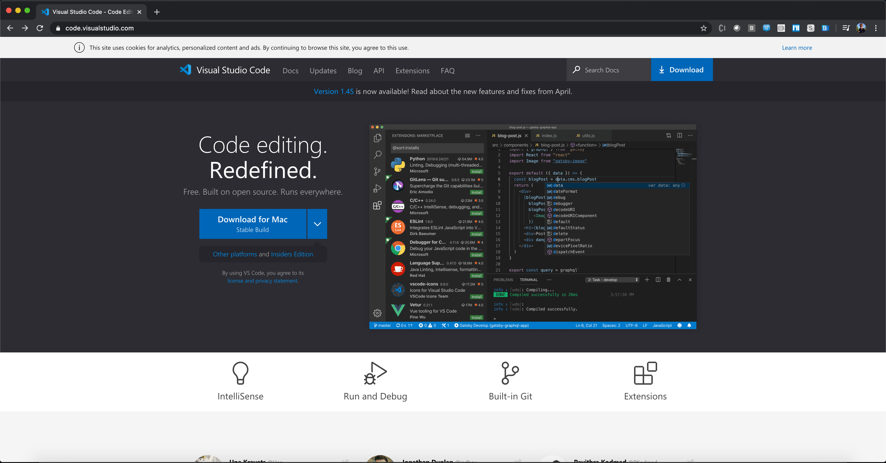
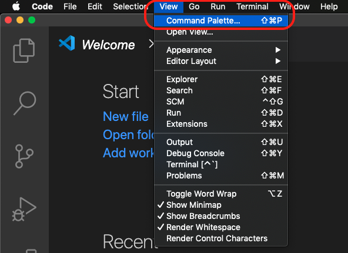
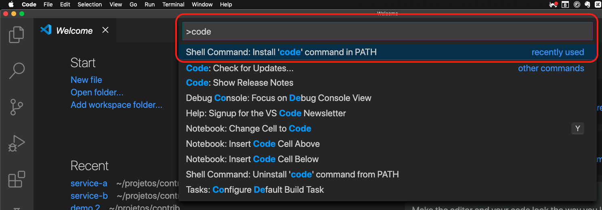
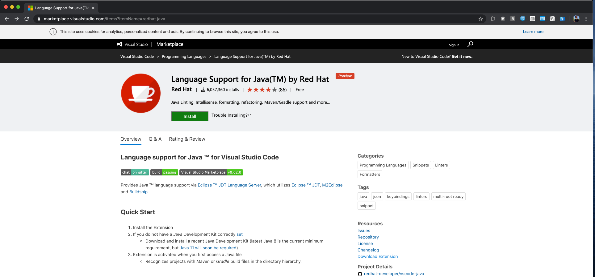
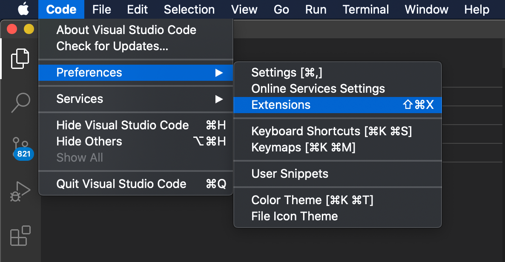
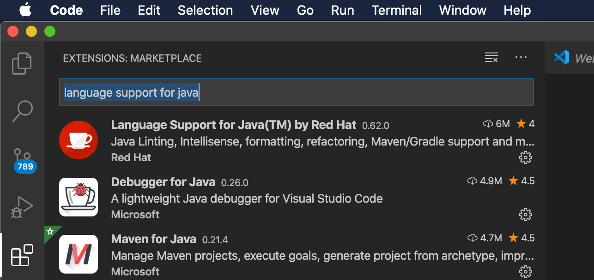
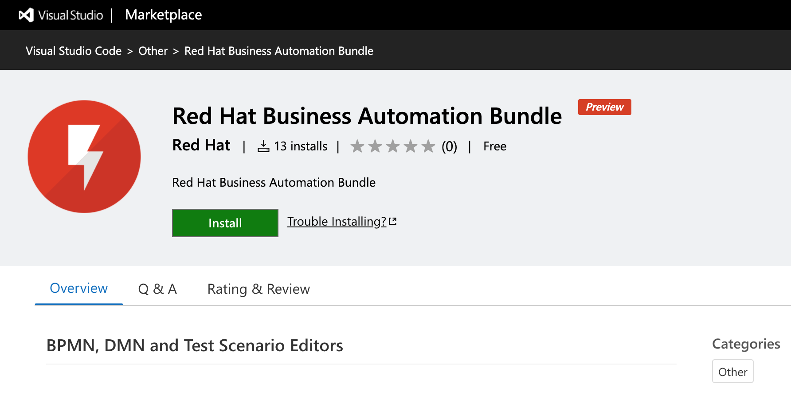
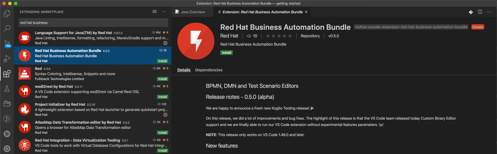
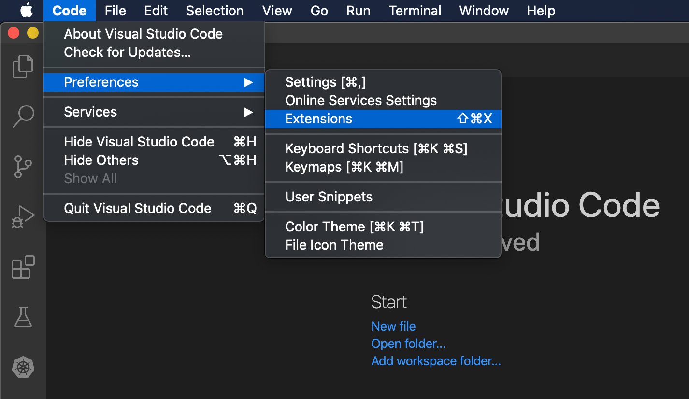
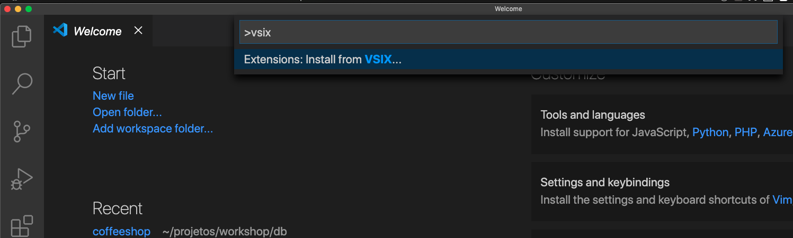

:scrollbar:
:toc2:
:source-highlighter: pygments
:pygments-style: emacs
:linkattrs:


= Kogito: Environment Setup Lab

== Goals of this Lab

* Install Visual Studio Code IDE;
* Install VSCode Language Support for Java;
* Install Kogito VSCode Plugins;
* Install GraalVM;
* Install cURL;

== Install Visual Studio Code IDE

To install Visual Studio Code version 1.46, navigate to the https://code.visualstudio.com/[VSCode website], and click the blue _Download_ button to download the VSCode 1.46 version for your operating system.



Follow the standard installation instructions.

If you do not want to get automatic updates, you can set the Update: Mode setting from default to none . To modify the update mode, go to File > Preferences > Settings (macOS: Code > Preferences > Settings), search for update mode and change the setting to none .

== Configure VSCode to run via Command Line

TIP: This is not required when you use Windows and have installed Visual Studio Code using the Windows installer.

Open VSCode, and look for the `Command Pallet` option:



Type `code` and select the option `Shell Command: install 'code' command in PATH`:



When you click the option above, VSCode will configure your operational system so that you can run the `code` command in your terminal to open VSCode.

== Install VSCode Language Support for Java

Red Hat provides a Language Support package for Java plugin for Visual Studio. As we will be writing some Java code in these labs, we will need to install this plugin in our VSCode environment.

There are multiple ways to do this:

=== Install Java Language Support plugin from the VSCode marketplace
You can install the plugin by navigating to the https://marketplace.visualstudio.com/items?itemName=redhat.java[VSCode Marketplace].
Click on the green *Install* button to install the extension in your VSCode environment.



=== Install Java Language Support plugin from VSCode.
You can also install the plugin directly from within VSCode. Navigate to _Preferences -> Extensions_.



In the search box, search for _language support for java_. The Red Hat extension should be on the top of the list.



Select the extension and click on the _Install_ button.


== Install Kogito VSCode Plugins

The Kogito VSCode extensions are available in the https://marketplace.visualstudio.com/publishers/redhat[Red Hat store of the Visual Studio Code Marketplace].

There are multiple ways top install the extension

=== Install Kogito plugin from the VSCode marketplace:

You can install the plugin by navigating to the Business Automation extension on the https://marketplace.visualstudio.com/items?itemName=redhat.vscode-extension-red-hat-business-automation-bundle[VSCode Marketplace].
Click on the green *Install* button to install the extension in your VSCode environment.




=== Install Kogito plugin from VSCode.

You can also install the plugin directly from within VSCode. Navigate to _Preferences -> Extensions_.


In the search box, search for _red hat business_. The Red Hat Business Automation extension should be one of the first in the list.



Select the extension and click on the _Install_ button.

<<<<<<< HEAD
TIP: If you are not able to find the option above, you can open the command pallet and look for `VSIX`:




Select the `vscode_extension_kogito_kie_editors_0.4.2.vsix` file we've just downloaded and click on _Install_. This will install the Kogito VSCode extension in your VSCode environment.
=======
>>>>>>> Upgraded to VSCode 1.46 and Kogito tooling in marketplace.


== Install GraalVM

GraalVM is a Java VM and JDK based on HotSpot/OpenJDK, implemented in Java.
It supports additional programming languages and execution modes, like ahead-of-time compilation of Java applications for fast startup and low memory footprint.

Although most of the exercises in our Kogito lab can be done on OpenJDK or Oracle Hotspot, we need GraalVM when we want to compile our application into _native executable_.

Download GraalVM Community 20.1.0 Java 11 (`graalvm-ce-java11`) from https://www.graalvm.org/downloads/[the following website] for your operating system, and follow the https://www.graalvm.org/getting-started/#install-graalvm[installation instructions] for your operating system.

You don't need the `ruby`, `r`, `python` and `wasm` packages. You only need the `native-image` package.

Getting Started with GraalVM:

* MacOS: https://www.graalvm.org/docs/getting-started/macos
* Linux: https://www.graalvm.org/docs/getting-started/linux
* Windows: https://www.graalvm.org/docs/getting-started/windows

TIP: If you find any "permission denied" errors while running the `setx` command, try opening your terminal (command line) as an admin user by right clicking the command shell icon, and selecting `run as administrator`.

TIP: If running on Windows, make sure GraalVM is the last Java configured on your PATH environment variable

== Install cURL

We use the cURL command line client in some of the exercises to send RESTful requests to our microservices.  Depending on your operating system, there are different ways of installing cURL:

* Linux: cURL is most likely part of your distribution and/or available in your Linux distribution's repository. Please install cURL using your distributions package management system.
* macOS: cURL comes installed with macOS. If you want to install the latest version of cURL, you can use https://brew.sh/[Homebrew].
* Windows: a Windows version of cURL can be downloaded https://curl.haxx.se/windows/[here].

To test if you have it properly set up, open the command line and try running:

```
$ curl —version
```

== Congratulations!

We've setup the complete platform to run our Kogito Labs.
