:scrollbar:
:toc2:
:source-highlighter: pygments
:pygments-style: emacs
:linkattrs:


= Kogito: Getting Started Lab

== What is Kogito?

image:images/logo.png[logo]

Kogito is Cloud Native Business Automation. Business Automation covers the application area of business processes, workflows, decisions, rules and optimization. Kogito brings these capabilities to the Cloud Native world by utilizing the latest innovations in the Java landscape, like [Quarkus](https://quarkus.io) and [GraalVM](https://graalvm.org), while building on battle-tested components.

The introduction of the microservices architectural style, and the rapid move to containers and cloud, has introduced new requirements for business applications. Decision and process logic form a large part of an enterprises IT landscape. The move to these new, highly distributed, application environments requires a new form of process automation and decision management. A form of business automation that utilizes concepts like microservices, reactive and event-driven applications, and serverless deployments and execution.

Kogito has been designed with this new world in mind, and provides first-class support for these different paradigms. The Kogito development model morphs to adapt itself to the type of application you are developing.

Kogito is a a Cloud Native Business Automation stack targetted at modern runtimes like [Quarkus](https://quarkus.io) and [Spring Boot](https://spring.io/projects/spring-boot). It's built on battle-tested capabilities like [Drools](https://www.drools.org), [jBPM](https://www.jbpm.org) and [OptaPlanner](https://www.optaplanner.org). Amazingly fast boot time, incredibly low RSS memory (not just heap size!) offering near instant scale up and high density memory utilization in container orchestration platforms like Kubernetes.

=== Kogito ergo Cloud

Kogito is designed from ground up to run at scale on cloud infrastructure. If you think about business automation think about the cloud, as this is where your business logic lives these days. By taking advantage of the latest technologies (Quarkus, knative, etc.), you get amazingly fast boot times and instant scaling on orchestration platforms like Kubernetes.

=== Kogito ergo Domain

Kogito adapts to your business domain rather than the other way around. No more leaking abstraction of the tool into your client applications. Stay focused on what the business is about, instead of being concerned with technology behind it.

=== Kogito ergo Power
Kogito offers a powerful developer experience based on battle-tested components. Achieve instant developer efficiency by having:

* Tooling embeddable wherever you need it
* Code generation taking care of 80% of the work
* Flexibility to customize, only use what you need
* Simplified local development with live reload


=== Goals of this Lab

* Implement a simple process.
* Execute in you local environment.
* Build a native image.

=== Prerequisites

* Visual Studio Code
* Kogito Tooling for Visual Studio Code
* JDK 11+
* Maven 3.6.3+
* cURL (or another client/tool with which RESTful requests can be sent to the Kogito application)
* GraalVM 20.x (Optional. Required if you want to run a native compilation)


= Create a basic project

The easiest way to create a new Kogito project is to execute the following Maven command:

```console
mvn archetype:generate \
  -DinteractiveMode=false \
  -DarchetypeGroupId=org.kie.kogito \
  -DarchetypeArtifactId=kogito-quarkus-archetype \
  -DarchetypeVersion=0.9.1 \
  -DgroupId=org.acme \
  -DartifactId=getting-started \
  -Dversion=1.0-SNAPSHOT
```

This will use the Kogito Quarkus Archetype and generate a basic Maven project for you in the `getting-started` subdirectory, generating:

* The Maven structure.
* Example `test-process.bpmn2` BPMN2 process definition.
* An OpenAPI Swagger-UI at `http://localhost:8080/swagger-ui`.

Once the project is generated, open the project in Visual Studio Code:

```
$ cd getting-started
$ code . --enable-proposed-api kiegroup.vscode-extension-pack-kogito-kie-editors
```

*Tip*: The Kogito VSCode extension uses a new proposed API for custom webview editors. This API will be officially supported by Microsoft at a later point in time. Until then, we need to use the property above.

In your Visual Studio Code IDE, with the generated project opened, look at the `pom.xml` file.

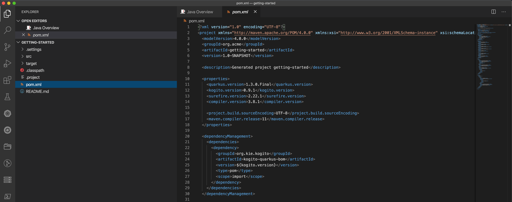

You will find the import of the Kogito BOM, allowing to omit the version on the different Kogito and Quarkus dependencies.
In addition, you can see the `quarkus-maven-plugin`, which is responsible for packaging of the application as well as allowing to start the application in development mode.

```xml
<dependencyManagement>
  <dependencies>
    <dependency>
      <groupId>org.kie.kogito</groupId>
      <artifactId>kogito-quarkus-bom</artifactId>
      <version>${kogito.version}</version>
      <type>pom</type>
      <scope>import</scope>
    </dependency>
  </dependencies>
</dependencyManagement>

<build>
    <plugins>
        <plugin>
            <groupId>io.quarkus</groupId>
            <artifactId>quarkus-maven-plugin</artifactId>
            <version>1.3.0.Final</version>
            <executions>
                <execution>
                    <goals>
                        <goal>build</goal>
                    </goals>
                </execution>
            </executions>
        </plugin>
    </plugins>
</build>
```

If we focus on the dependencies section, you can see we are using the Kogito Quarkus extension, which enables the development of Kogito applications on Quarkus:
```xml
<dependency>
  <groupId>org.kie.kogito</groupId>
  <artifactId>kogito-quarkus</artifactId>
</dependency>
```

= Running the Application

Go back to your terminal (or open the integrated terminal in Visual Studio Code).

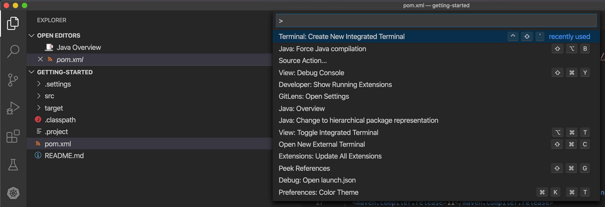

Make sure that you're in the root directory of the `getting-started` project (the directory containing the `pom.xml` file).
We are ready to run our application. Run the following command to start the application in Quarkus development mode:

`$ mvn clean compile quarkus:dev`

You should see:

```console
2020-05-19 17:47:18,242 INFO  [io.quarkus] (main) getting-started 1.0-SNAPSHOT (powered by Quarkus 1.3.0.Final) started in 4.652s. Listening on: http://0.0.0.0:8080
2020-05-19 17:47:18,245 INFO  [io.quarkus] (main) Profile dev activated. Live Coding activated.
2020-05-19 17:47:18,246 INFO  [io.quarkus] (main) Installed features: [cdi, kogito, resteasy, resteasy-jackson, smallrye-openapi, swagger-ui]
```

Note that Maven might need to download a number of dependencies if this is the first time you're building a Kogito application on your system. This can take some time.

After the dependencies have been downloaded, and the application has been compiled, note the amazingly fast startup time! Once started, you can request the provided Swagger UI in the browser at: http://localhost:8080/swagger-ui

You should see the following page, which shows the API of the sample Kogito _Greetings_ service provided by the archetype:

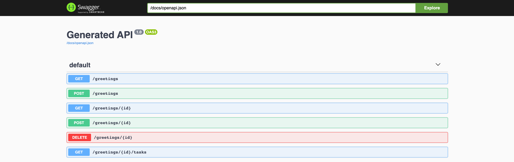

It's working!

== Congratulations!

You've seen how to create the skeleton of basic Kogito app, package it and start it up very quickly in `quarkus:dev` mode. We'll leave the app running and rely on hot reload for the next steps.

In the next step we'll create a BPMN2 process definition to demonstrate Kogito's code generation, hot-reload and workflow capabilities.

= Create a Process Definition

In the previous step you've created a skeleton Kogito application with Quarkus. In this step we'll create our first process definition in BPMN2. We will see how Kogito is able to generate a microservice, including RESTful resources, from our business assets (e.g. process definitions, decisions, etc.).

We will create a simple process that will look like this:

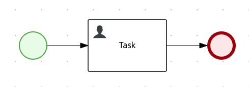

Create a new BPMN2 file in the project's `src/main/resources` folder and name it `getting-started.bpmn`.

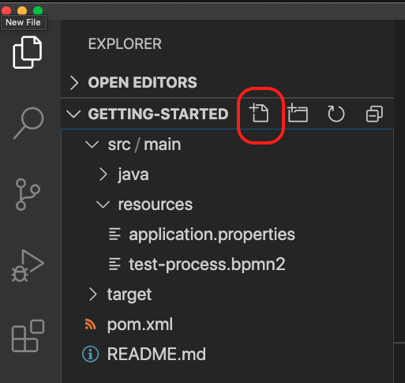

This will automatically open the Kogito BPMN2 editor.

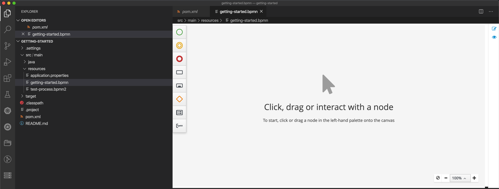

BPMN2 allows us to define a graphical representation of a process (or workflow), and as such, we need a BPMN2 editor to implement our process.

Implement the process as shown in the following video. Make sure to use `getting_started` for the **name** and **id** of the process and `org.acme` for the **package**.

https://youtu.be/babjHSNrZBg

Make sure to save the file after you've implemented the process.

*Alternatively*, you can copy the following BPMN2 definition to the BPMN file:

*TIP:* if you find issues with VSCode while trying to open the BPMN in the text editor, follow these steps:

  1. Open the BPMN file using the process designer
  2. Open the `Command Pallet` (e.g. cmd+shift+p), type `reopen` and select `File: Reopen With...`

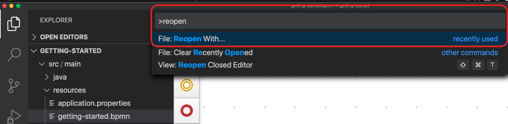

  3. Next, select `Text Editor`

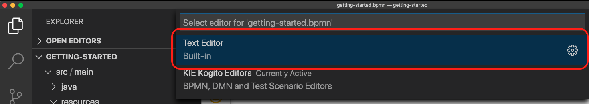

Paste the following XML in the Text Editor and save the file.

```xml
<bpmn2:definitions xmlns:xsi="http://www.w3.org/2001/XMLSchema-instance" xmlns:bpmn2="http://www.omg.org/spec/BPMN/20100524/MODEL" xmlns:bpmndi="http://www.omg.org/spec/BPMN/20100524/DI" xmlns:bpsim="http://www.bpsim.org/schemas/1.0" xmlns:dc="http://www.omg.org/spec/DD/20100524/DC" xmlns:di="http://www.omg.org/spec/DD/20100524/DI" xmlns:drools="http://www.jboss.org/drools" id="_3B7B4D14-4B20-497A-868A-D7B55CD93887" exporter="jBPM Process Modeler" exporterVersion="2.0" targetNamespace="http://www.omg.org/bpmn20">
  <bpmn2:itemDefinition id="__8C980097-4DBD-4BAF-B991-73EC1419E8CE_SkippableInputXItem" structureRef="Object"/>
  <bpmn2:itemDefinition id="__8C980097-4DBD-4BAF-B991-73EC1419E8CE_PriorityInputXItem" structureRef="Object"/>
  <bpmn2:itemDefinition id="__8C980097-4DBD-4BAF-B991-73EC1419E8CE_CommentInputXItem" structureRef="Object"/>
  <bpmn2:itemDefinition id="__8C980097-4DBD-4BAF-B991-73EC1419E8CE_DescriptionInputXItem" structureRef="Object"/>
  <bpmn2:itemDefinition id="__8C980097-4DBD-4BAF-B991-73EC1419E8CE_CreatedByInputXItem" structureRef="Object"/>
  <bpmn2:itemDefinition id="__8C980097-4DBD-4BAF-B991-73EC1419E8CE_TaskNameInputXItem" structureRef="Object"/>
  <bpmn2:itemDefinition id="__8C980097-4DBD-4BAF-B991-73EC1419E8CE_GroupIdInputXItem" structureRef="Object"/>
  <bpmn2:itemDefinition id="__8C980097-4DBD-4BAF-B991-73EC1419E8CE_ContentInputXItem" structureRef="Object"/>
  <bpmn2:itemDefinition id="__8C980097-4DBD-4BAF-B991-73EC1419E8CE_NotStartedReassignInputXItem" structureRef="Object"/>
  <bpmn2:itemDefinition id="__8C980097-4DBD-4BAF-B991-73EC1419E8CE_NotCompletedReassignInputXItem" structureRef="Object"/>
  <bpmn2:itemDefinition id="__8C980097-4DBD-4BAF-B991-73EC1419E8CE_NotStartedNotifyInputXItem" structureRef="Object"/>
  <bpmn2:itemDefinition id="__8C980097-4DBD-4BAF-B991-73EC1419E8CE_NotCompletedNotifyInputXItem" structureRef="Object"/>
  <bpmn2:process id="getting_started" drools:packageName="org.acme" drools:version="1.0" drools:adHoc="false" name="getting_started" isExecutable="true" processType="Public">
    <bpmn2:sequenceFlow id="_3B95A0A8-3313-487C-A14E-972E04D228B5" sourceRef="_8C980097-4DBD-4BAF-B991-73EC1419E8CE" targetRef="_3F791B0E-1549-441F-AA55-B70154E227B2">
      <bpmn2:extensionElements>
        <drools:metaData name="isAutoConnection.source">
          <drools:metaValue>true</drools:metaValue>
        </drools:metaData>
        <drools:metaData name="isAutoConnection.target">
          <drools:metaValue>true</drools:metaValue>
        </drools:metaData>
      </bpmn2:extensionElements>
    </bpmn2:sequenceFlow>
    <bpmn2:sequenceFlow id="_D96968A8-096F-441E-BEF5-69B5EB7B1C91" sourceRef="_3872BDA1-71C9-49B4-B15F-9800547FEA0A" targetRef="_8C980097-4DBD-4BAF-B991-73EC1419E8CE">
      <bpmn2:extensionElements>
        <drools:metaData name="isAutoConnection.source">
          <drools:metaValue>true</drools:metaValue>
        </drools:metaData>
        <drools:metaData name="isAutoConnection.target">
          <drools:metaValue>true</drools:metaValue>
        </drools:metaData>
      </bpmn2:extensionElements>
    </bpmn2:sequenceFlow>
    <bpmn2:endEvent id="_3F791B0E-1549-441F-AA55-B70154E227B2">
      <bpmn2:incoming>_3B95A0A8-3313-487C-A14E-972E04D228B5</bpmn2:incoming>
    </bpmn2:endEvent>
    <bpmn2:userTask id="_8C980097-4DBD-4BAF-B991-73EC1419E8CE" name="Task">
      <bpmn2:extensionElements>
        <drools:metaData name="elementname">
          <drools:metaValue>Task</drools:metaValue>
        </drools:metaData>
      </bpmn2:extensionElements>
      <bpmn2:incoming>_D96968A8-096F-441E-BEF5-69B5EB7B1C91</bpmn2:incoming>
      <bpmn2:outgoing>_3B95A0A8-3313-487C-A14E-972E04D228B5</bpmn2:outgoing>
      <bpmn2:ioSpecification id="_FdyD4AJMEDiMpvp3hRnB7A">
        <bpmn2:dataInput id="_8C980097-4DBD-4BAF-B991-73EC1419E8CE_TaskNameInputX" drools:dtype="Object" itemSubjectRef="__8C980097-4DBD-4BAF-B991-73EC1419E8CE_TaskNameInputXItem" name="TaskName"/>
        <bpmn2:dataInput id="_8C980097-4DBD-4BAF-B991-73EC1419E8CE_SkippableInputX" drools:dtype="Object" itemSubjectRef="__8C980097-4DBD-4BAF-B991-73EC1419E8CE_SkippableInputXItem" name="Skippable"/>
        <bpmn2:inputSet id="_Fdyq8AJMEDiMpvp3hRnB7A">
          <bpmn2:dataInputRefs>_8C980097-4DBD-4BAF-B991-73EC1419E8CE_TaskNameInputX</bpmn2:dataInputRefs>
          <bpmn2:dataInputRefs>_8C980097-4DBD-4BAF-B991-73EC1419E8CE_SkippableInputX</bpmn2:dataInputRefs>
        </bpmn2:inputSet>
      </bpmn2:ioSpecification>
      <bpmn2:dataInputAssociation id="_Fdyq8QJMEDiMpvp3hRnB7A">
        <bpmn2:targetRef>_8C980097-4DBD-4BAF-B991-73EC1419E8CE_TaskNameInputX</bpmn2:targetRef>
        <bpmn2:assignment id="_Fdyq8gJMEDiMpvp3hRnB7A">
          <bpmn2:from xsi:type="bpmn2:tFormalExpression" id="_Fdz5EAJMEDiMpvp3hRnB7A">Task</bpmn2:from>
          <bpmn2:to xsi:type="bpmn2:tFormalExpression" id="_Fd0gIAJMEDiMpvp3hRnB7A">_8C980097-4DBD-4BAF-B991-73EC1419E8CE_TaskNameInputX</bpmn2:to>
        </bpmn2:assignment>
      </bpmn2:dataInputAssociation>
      <bpmn2:dataInputAssociation id="_Fd0gIQJMEDiMpvp3hRnB7A">
        <bpmn2:targetRef>_8C980097-4DBD-4BAF-B991-73EC1419E8CE_SkippableInputX</bpmn2:targetRef>
        <bpmn2:assignment id="_Fd0gIgJMEDiMpvp3hRnB7A">
          <bpmn2:from xsi:type="bpmn2:tFormalExpression" id="_Fd1HMAJMEDiMpvp3hRnB7A">false</bpmn2:from>
          <bpmn2:to xsi:type="bpmn2:tFormalExpression" id="_Fd1HMQJMEDiMpvp3hRnB7A">_8C980097-4DBD-4BAF-B991-73EC1419E8CE_SkippableInputX</bpmn2:to>
        </bpmn2:assignment>
      </bpmn2:dataInputAssociation>
    </bpmn2:userTask>
    <bpmn2:startEvent id="_3872BDA1-71C9-49B4-B15F-9800547FEA0A">
      <bpmn2:outgoing>_D96968A8-096F-441E-BEF5-69B5EB7B1C91</bpmn2:outgoing>
    </bpmn2:startEvent>
  </bpmn2:process>
  <bpmndi:BPMNDiagram>
    <bpmndi:BPMNPlane bpmnElement="getting_started">
      <bpmndi:BPMNShape id="shape__3872BDA1-71C9-49B4-B15F-9800547FEA0A" bpmnElement="_3872BDA1-71C9-49B4-B15F-9800547FEA0A">
        <dc:Bounds height="56" width="56" x="176" y="319"/>
      </bpmndi:BPMNShape>
      <bpmndi:BPMNShape id="shape__8C980097-4DBD-4BAF-B991-73EC1419E8CE" bpmnElement="_8C980097-4DBD-4BAF-B991-73EC1419E8CE">
        <dc:Bounds height="102" width="154" x="331" y="296"/>
      </bpmndi:BPMNShape>
      <bpmndi:BPMNShape id="shape__3F791B0E-1549-441F-AA55-B70154E227B2" bpmnElement="_3F791B0E-1549-441F-AA55-B70154E227B2">
        <dc:Bounds height="56" width="56" x="617" y="319"/>
      </bpmndi:BPMNShape>
      <bpmndi:BPMNEdge id="edge_shape__3872BDA1-71C9-49B4-B15F-9800547FEA0A_to_shape__8C980097-4DBD-4BAF-B991-73EC1419E8CE" bpmnElement="_D96968A8-096F-441E-BEF5-69B5EB7B1C91">
        <di:waypoint x="232" y="347"/>
        <di:waypoint x="331" y="347"/>
      </bpmndi:BPMNEdge>
      <bpmndi:BPMNEdge id="edge_shape__8C980097-4DBD-4BAF-B991-73EC1419E8CE_to_shape__3F791B0E-1549-441F-AA55-B70154E227B2" bpmnElement="_3B95A0A8-3313-487C-A14E-972E04D228B5">
        <di:waypoint x="485" y="347"/>
        <di:waypoint x="617" y="347"/>
      </bpmndi:BPMNEdge>
    </bpmndi:BPMNPlane>
  </bpmndi:BPMNDiagram>
  <bpmn2:relationship id="_Fd2VUAJMEDiMpvp3hRnB7A" type="BPSimData">
    <bpmn2:extensionElements>
      <bpsim:BPSimData>
        <bpsim:Scenario id="default" name="Simulationscenario">
          <bpsim:ScenarioParameters/>
          <bpsim:ElementParameters elementRef="_3872BDA1-71C9-49B4-B15F-9800547FEA0A">
            <bpsim:TimeParameters>
              <bpsim:ProcessingTime>
                <bpsim:NormalDistribution mean="0" standardDeviation="0"/>
              </bpsim:ProcessingTime>
            </bpsim:TimeParameters>
          </bpsim:ElementParameters>
          <bpsim:ElementParameters elementRef="_8C980097-4DBD-4BAF-B991-73EC1419E8CE">
            <bpsim:TimeParameters>
              <bpsim:ProcessingTime>
                <bpsim:NormalDistribution mean="0" standardDeviation="0"/>
              </bpsim:ProcessingTime>
            </bpsim:TimeParameters>
            <bpsim:ResourceParameters>
              <bpsim:Availability>
                <bpsim:FloatingParameter value="0"/>
              </bpsim:Availability>
              <bpsim:Quantity>
                <bpsim:FloatingParameter value="0"/>
              </bpsim:Quantity>
            </bpsim:ResourceParameters>
            <bpsim:CostParameters>
              <bpsim:UnitCost>
                <bpsim:FloatingParameter value="0"/>
              </bpsim:UnitCost>
            </bpsim:CostParameters>
          </bpsim:ElementParameters>
        </bpsim:Scenario>
      </bpsim:BPSimData>
    </bpmn2:extensionElements>
    <bpmn2:source>_3B7B4D14-4B20-497A-868A-D7B55CD93887</bpmn2:source>
    <bpmn2:target>_3B7B4D14-4B20-497A-868A-D7B55CD93887</bpmn2:target>
  </bpmn2:relationship>
</bpmn2:definitions>
```

Since we still have our app running using `mvn quarkus:dev`, when you make these changes and reload the endpoint, Quarkus will notice all of these changes and live-reload them, including changes in your business assets (i.e. processes, decision, rules, etc.).

Check that it works as expected by opening the Swagger-UI endpoint at: http://localhost:8080/swagger-ui
The Swagger-UI will show the REST resources that have been generated from the project's _business assets_, in this case the `getting_started` resource, which is backed by our process definition (note that the sample _Greetings_ resource is also still shown in the Swagger UI).

In the Swagger UI, expand the **POST /getting_started** resource. Click on the **Try it out** button on the right-hand-side of the screen.
Click on the blue **Execute** button to fire the request. The response will be the instance-id/process-id of the created **getting_started** resource.

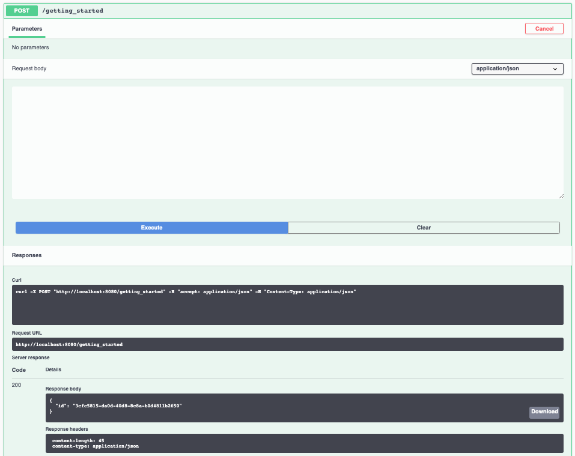

Apart from the Swagger-UI, we can also call our RESTful resources from any REST client, for example via a **cURL** in a terminal.

If you have a cURL installed on your machine, open a new terminal (for example a second integrated terminal in VSCode) and execute the following cURL command

`$ curl -X GET "http://localhost:8080/getting_started" -H "accept: application/json"`

Our process defintion contains a *UserTask*. To retrieve the tasks of an instance, we need to execute another REST operation.

Let's go back to the http://localhost:8080/swagger-ui[Swagger-UI]. Expand the **GET ​/getting_started​/{id}​/tasks** operation, and click on the **Try it out** button.
In the `id` field, fill in the value of the process instance id the previous command returned. Now, click on the **Execute** button.

This will return a list of **Tasks**.

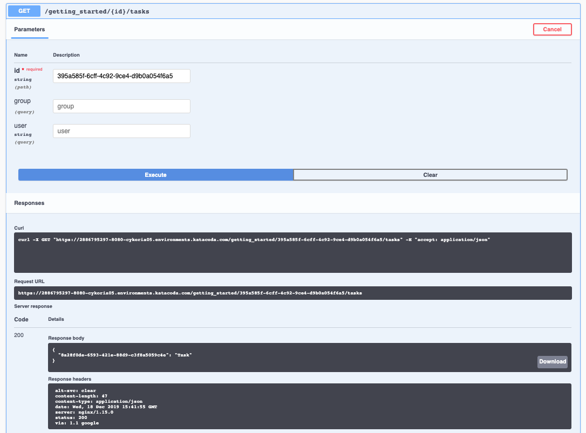

Since we haven't defined any Task input and output data yet, we can simply complete the task without providing any data.
We will again do this from the http://localhost:8080/swagger-ui[Swagger-UI]. Expand the **POST ​/getting_started​/{id}​/Task/{workitemId}** operation, and click on the **Try it out** button.
In the `id` field, fill in the value of the process instance id, and fill in the task-id that we retrieved with our previous REST call in the `workItemId` field. Now, click on the **Execute** button.

This will complete the task, and the process will continue and reach the *End* node and complete.

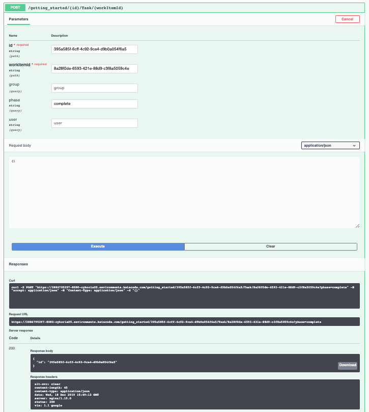

With the task completed, the process instance will now be completed. If you've cURL installed on your system, execute the following command in a terminal. Notice that there are no process instances returned:

`$ curl -X GET "http://localhost:8080/getting_started" -H "accept: application/json"`

== Congratulations!

You've created your first Kogito application. You've defined a process in BPMN2, have seen the **live-reload** in action. You've experienced how Kogito automatically generates REST resources based on your process definition. Finally, you've started a process instance, retrieved the task list, completed a task and thereby finished the process instance.

= Package and Run

In the previous step you added a process definition to your Kogito application. Now it's time to package and run it as a self-contained JAR file.

Let's stop the original application so we can package and re-run it as an executable JAR. In the terminal in which the application is running, press `CTRL-C` to stop the application.

== Package the app

In a terminal, execute the following Maven command to package the application:

`$ mvn clean package`

It produces 2 jar files:

* `getting-started-1.0-SNAPSHOT.jar` - containing just the classes and resources of the projects, it’s the regular artifact produced by the Maven build.

* `getting-started-1.0-SNAPSHOT-runner.jar` - being an executable jar. Be aware that it’s not an über-jar as the dependencies are copied into the `target/lib` directory.

See the files with this command:

`ls -l target/*.jar`

== Run the executable JAR

You can run the packaged application by executing the following command in a terminal:

`$ java -jar target/getting-started-1.0-SNAPSHOT-runner.jar`

We can test our application again using the cURL command from a terminal to create a new process instance:

`$ curl -X POST "http://localhost:8080/getting_started" -H "accept: application/json" -H "Content-Type: application/json" -d "{}"`

The output shows the id of the new instance (note that your id will be different from the one shown here)

```console
{"id":"4844cfc0-ea93-46e3-8213-c10517bde1ce"}
```

NOTE: When we're not running in `mvn quarkus:dev` mode, the Swagger UI is not available. It can however be enabled by adding the following configuration to your `src/main/resources/application.properties` file: `quarkus.swagger-ui.always-include=true`

NOTE: The `Class-Path` entry of the `MANIFEST.MF` file in the _runner JAR_ explicitly lists the jars from the `lib` directory. So if you want to deploy your application somewhere, you need to copy the _runner JAR_ as well as the _lib_ directory. If you want to create an _Uber-JAR_ with everything included, you can use `mvn package -DuberJar`.

== Cleanup

Go back to the terminal in which the Kogito application is running and stop the application once again by pressing `CTRL-C`.

== Congratulations!

You've packaged up the Kogito app as an executable JAR and learned a bit more about the mechanics of packaging. In the next step, we'll continue our journey and build a _native image_. You will learn about the creation of a native executable and the packaging of such an executable in a Linux container.


= Build a Native Image (optional)

Let’s now produce a native executable for our application. It improves the startup time of the application, and produces a minimal disk footprint.
The executable would have everything to run the application including the "JVM" (shrunk to be just enough to run the application), and the application.

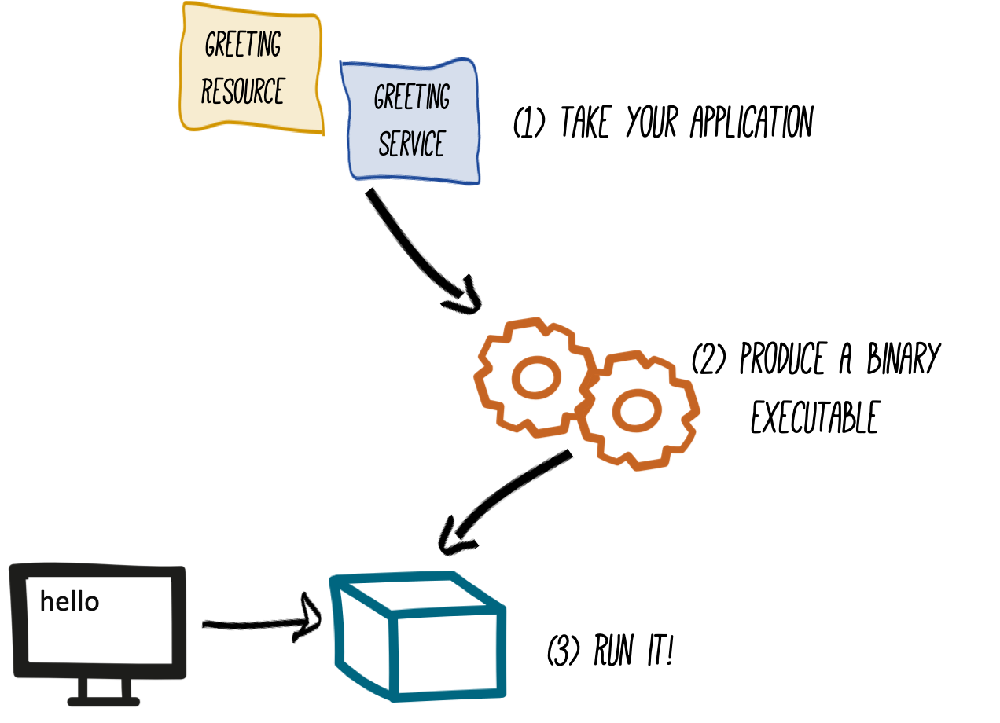

We will be using GraalVM, which includes a native compiler for producing native images for a number of languages, including Java.

== Build native image

Within the `pom.xml` file of our application is the declaration for the Quarkus Maven plugin which contains a profile for `native-image`:

```xml
<profile>
  <id>native</id>
  <build>
    <plugins>
      <plugin>
        <groupId>io.quarkus</groupId>
        <artifactId>quarkus-maven-plugin</artifactId>
        <executions>
          <execution>
            <goals>
              <goal>native-image</goal>
            </goals>
          </execution>
        </executions>
      </plugin>
      <plugin>
        <groupId>org.apache.maven.plugins</groupId>
        <artifactId>maven-failsafe-plugin</artifactId>
        <version>${surefire.version}</version>
      </plugin>
    </plugins>
  </build>
</profile>
```
We use a profile because, you will see very soon, packaging the native image takes a few seconds (or rather: minutes).
However, this compilation time is only incurred _once_, as opposed to _every_ time the application starts, which is the case with other approaches for building and executing JARs.

In your terminal, if the application is still running, stop it with `Ctrl-C`.
Next, create a native executable by executing the followig Maven command:
`$ mvn clean package -Pnative -DskipTests=true`

NOTE: Native image are compiled for the architecture on which the image is compiled. When you run a native image compilation on a Linux machine, the target OS of the native executable is Linux. When you build a native image on macOS, the target operating system is macOS.
Hence, an executable built on macOS will not run on a Linux platform. If you need to build native Linux binaries when on other OS's like Windows or macOS, you can use `-Dquarkus.native.container-runtime=[podman | docker]`. You'll need either Docker or [Podman](https://podman.io) installed depending on which container runtime you want to use!

The native compilation will take a couple of minutes to finish. Wait for it!

In addition to the regular files, the build also produces `target/getting-started-1.0-SNAPSHOT-runner`. This is a native binary for your operating system. If you're on a Linux or macOS system, you can determine the file-type with the `file` command:

`$ file target/getting-started-1.0-SNAPSHOT-runner`

```console
$ file target/getting-started-1.0-SNAPSHOT-runner
target/getting-started-1.0-SNAPSHOT-runner: Mach-O 64-bit executable x86_64
```

== Run native image

Since you're building the native image for your own system, you can simply run it with the following command:

`$ target/getting-started-1.0-SNAPSHOT-runner`

Notice the amazingly fast startup time:

```console
__  ____  __  _____   ___  __ ____  ______
 --/ __ \/ / / / _ | / _ \/ //_/ / / / __/
 -/ /_/ / /_/ / __ |/ , _/ ,< / /_/ /\ \
--\___\_\____/_/ |_/_/|_/_/|_|\____/___/
2020-04-15 13:48:19,193 INFO  [io.quarkus] (main) getting-started 1.0-SNAPSHOT (powered by Quarkus 1.3.0.Final) started in 0.021s. Listening on: http://0.0.0.0:8080
2020-04-15 13:48:19,193 INFO  [io.quarkus] (main) Profile prod activated.
2020-04-15 13:48:19,193 INFO  [io.quarkus] (main) Installed features: [cdi, kogito, resteasy, resteasy-jackson, smallrye-openapi, swagger-ui]
```
That's 21 milliseconds (twenty one!!!) to start a full business application, exposing a REST API and ready to serve requests in a shared learning environment!

On Linux and macOS, you can report the memory usage of your application with the `ps` utility. Notice the extremely low memory usage as reported:

`$ ps -o pid,rss,command -p $(pgrep -f runner)`

You should see something like:

```console
  PID   RSS COMMAND
3003 26384 target/getting-started-1.0-SNAPSHOT-runner
```

This shows that our process is taking around 27 MB of memory ([Resident Set Size](https://en.wikipedia.org/wiki/Resident_set_size), or RSS). Pretty compact!

NOTE: The RSS and memory usage of any app, including Quarkus, will vary depending your specific environment, and will rise as the application experiences load.

Make sure the app is still working as expected by creating a new process instance using cURL:

`$ curl -X POST "http://localhost:8080/getting_started" -H "accept: application/json" -H "Content-Type: application/json" -d "{}"`{{execute T2}}

```console
$ curl -X POST "http://localhost:8080/getting_started" -H "accept: application/json" -H "Content-Type: application/json" -d "{}"
{"id":"75c00bcc-97a5-4655-beee-9b0b7b320d19"}
```

Nice!

== Congratulations!

You've now built a Kogito application as an executable JAR and a Linux native binary. Well done.

This concludes our getting-started lab of Kogito.

In this lab, you learned about Kogito, and how it can be used to create cloud-native business automation applications.
Kogito provides an effective solution for running business automation workloads, like processes, workflows, decisions and rules, in this new world of serverless, microservices, containers, Kubernetes, FaaS, and the cloud, because it has been designed with these use-cases in mind.

Its domain-driven and developer-focussed approach for cloud-native business applications is achieved through the extensive use of code generation based on your business assets (e.g. process definitions, decision models).
This allows you to focus on the actual business problem you're trying to solve, rather than the technical details of the platform and runtimes.
