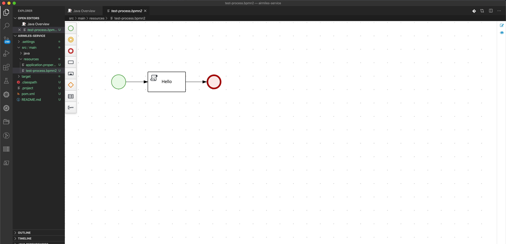
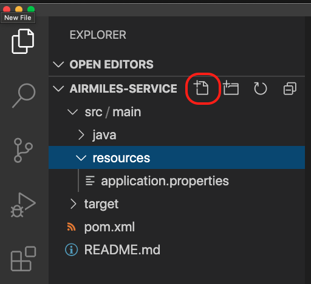
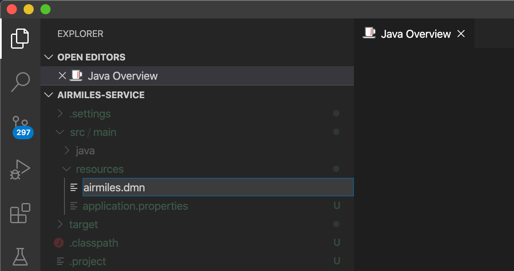
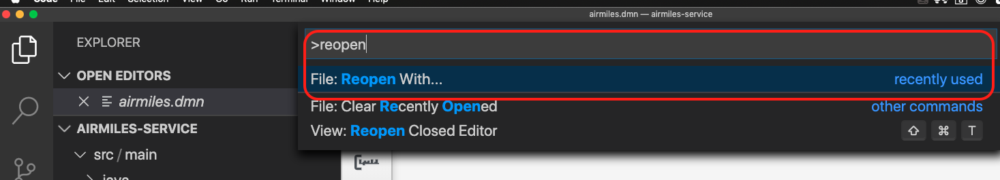
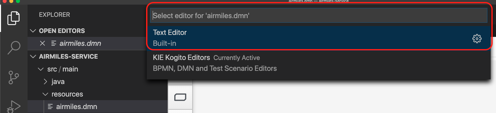
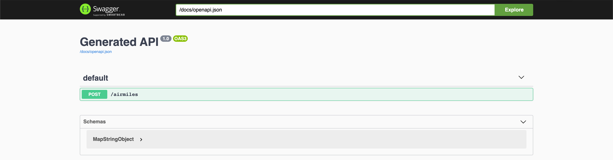

:scrollbar:
:toc2:
:source-highlighter: pygments
:pygments-style: emacs
:linkattrs:


= Kogito: Decision Model & Notation (DMN) Lab

== What is Kogito?

image:images/logo.png[logo]

Kogito is Cloud Native Business Automation. Business Automation covers the application area of business processes, workflows, decisions, rules and optimization. Kogito brings these capabilities to the Cloud Native world by utilizing the latest innovations in the Java landscape, like [Quarkus](https://quarkus.io) and [GraalVM](https://graalvm.org), while building on battle-tested components.

The introduction of the microservices architectural style, and the rapid move to containers and cloud, has introduced new requirements for business applications. Decision and process logic form a large part of an enterprises IT landscape. The move to these new, highly distributed, application environments requires a new form of process automation and decision management. A form of business automation that utilizes concepts like microservices, reactive and event-driven applications, and serverless deployments and execution.

Kogito has been designed with this new world in mind, and provides first-class support for these different paradigms. The Kogito development model morphs to adapt itself to the type of application you are developing.

Kogito is a a Cloud Native Business Automation stack targetted at modern runtimes like [Quarkus](https://quarkus.io) and [Spring Boot](https://spring.io/projects/spring-boot). It's built on battle-tested capabilities like [Drools](https://www.drools.org), [jBPM](https://www.jbpm.org) and [OptaPlanner](https://www.optaplanner.org). Amazingly fast boot time, incredibly low RSS memory (not just heap size!) offering near instant scale up and high density memory utilization in container orchestration platforms like Kubernetes.

=== Kogito ergo Cloud

Kogito is designed from ground up to run at scale on cloud infrastructure. If you think about business automation think about the cloud, as this is where your business logic lives these days. By taking advantage of the latest technologies (Quarkus, knative, etc.), you get amazingly fast boot times and instant scaling on orchestration platforms like Kubernetes.

=== Kogito ergo Domain

Kogito adapts to your business domain rather than the other way around. No more leaking abstraction of the tool into your client applications. Stay focused on what the business is about, instead of being concerned with technology behind it.

=== Kogito ergo Power
Kogito offers a powerful developer experience based on battle-tested components. Achieve instant developer efficiency by having:

* Tooling embeddable wherever you need it
* Code generation taking care of 80% of the work
* Flexibility to customize, only use what you need
* Simplified local development with live reload


=== Goals of this Lab

* Implement a DMN decision service in Kogito.
* Execute in you local environment.
* Create a native image.

=== Prerequisites

* Visual Studio Code
* Kogito Tooling for Visual Studio Code
* JDK 11+
* Maven 3.6.3+
* cURL (or another client/tool with which RESTful requests can be sent to the Kogito application)
* GraalVM 20.x (Optional. Required if you want to run a native compilation)


= Decision Model & Notation

_Decision Model & Notation_ (DMN) is a standard by the Object Management Group (OMG) for decision modeling.
DMN is to decisions what BPMN is for processes and workflows.
DMN is targeted at both business users and developers and can be used to implement complex decision logic in a graphical notation.

In this step, we will create the Kogito application skeleton.

= The Application We Will Build

The application is a decision microservice which determines the airmiles a person will get based on his/her frequent flyer status and the price of the flight.

You will implement these rules in a DMN (Decision Model & Notation) model, using DMN DRDs (Decision Requirement Diagram), decision tables and DMN FEEL (Friendly Enough Expression Language) expressions.

Let's get started.

= Create a basic project

The easiest way to create a new Kogito project is to execute the Maven command in a terminal:

```console
mvn archetype:generate \
  -DinteractiveMode=false \
  -DarchetypeGroupId=org.kie.kogito \
  -DarchetypeArtifactId=kogito-quarkus-archetype \
  -DarchetypeVersion=0.9.1 \
  -DgroupId=org.acme \
  -DartifactId=airmiles-service \
  -Dversion=1.0-SNAPSHOT
```

This will use the Kogito Maven Archetype and generate a basic Maven project for you in the `airmiles-service` subdirectory. The project consists of:

* The Maven structure.
* Example `test-process.bpmn2` BPMN2 process definition.
* An OpenAPI Swagger-UI at `http://localhost:8080/swagger-ui`.

Once the project is generated, open the project in Visual Studio Code:

```
$ cd airmiles-service
$ code . --enable-proposed-api kiegroup.vscode-extension-pack-kogito-kie-editors
```

TIP: The Kogito VSCode extension uses a new proposed API for custom webview editors. This API will be officially supported by Microsoft at a later point in time. Until then, we need to use the property above.

The default Kogito application created from the archetype contains a sample process called `test-process.bpmn2`. We will remove this process definition, as it is not required for our application.
In your Visual Studio Code IDE, open the `src/main/resources` folder of the project and delete the `test-process.bpmn2` file.



== Running the Application

We will now run the Kogito application in development mode. This allows us to keep the application running while implementing our application logic.
Kogito and Quarkus will _hot reload_ the application when it is accessed and changes have been detected.

Go back to your terminal (or open the integrated terminal in Visual Studio Code).

image:images/vscode-integrated-terminal.png[VSCode POM]

Make sure that you're in the root directory of the `airmiles-service` project (the directory containing the `pom.xml` file).
We are ready to run our application. Run the following command to start the application in Quarkus development mode:

`$ mvn clean compile quarkus:dev`

When the application has started, you can access the http://localhost:8080/swagger-ui[Swagger UI]

You should see the following page:

image:images/new-kogito-quarkus-empty-swagger-ui.png[]

It's working!

== Congratulations!

You've seen how to create the skeleton of basic Kogito app, and start the application in _Quarkus dev-mode_.


= DMN: Decision Model & Notation

Decision Model and Notation (DMN) is a standard by the Object Management Group (OMG) for describing and modeling decision logic.
It provides a developer and business friendly way to design and model complex decisions using constructs like DRDs (Decision Requirement Diagrams),
decision tables, boxed expressions and FEEL (Friendly Enough Expression Language) expressions.

DMN is to decision logic what BPMN is to business process logic.

The Kogito DMN engine is the most powerful DMN decision engine on the market, and the only engine that can run cloud-natively in a container environment.

== Creating the Model

To create our DMN model, we first need to create a new file. In your VSCode IDE, open the `src/main/resources` folder.
In this folder, create a new file called `airmiles.dmn`.





This will automatically open the Kogito DMN editor.

DMN uses a graphical modeling language/notation to define decisions. Therefore, Kogito provides a graphical DMN editor as part of its toolset.
Apart from providing this editor as an extension to _Visual Studio Code_ and _Red Hat Code Ready Workspaces_, we also  provide this editor online.

With the editor opened, implement the decision logic as shown in the following video.

https://youtu.be/NAO0eV5c5tE

Make sure to save the file after you've implemented the process.

*Alternatively*, you can copy the following DMN definition to the DMN file.

*TIP:* if you find issues with VSCode while trying to open the DMN in the text editor, follow these steps:

  1. Open the DMN file using the designer
  2. Open the `Command Pallet` (e.g. cmd+shift+p), type `reopen` and select `File: Reopen With...`


  3. Next, select `Text Editor`


Paste the following XML in the Text Editor and save the file.

```xml
<dmn:definitions xmlns:dmn="http://www.omg.org/spec/DMN/20180521/MODEL/" xmlns="https://kiegroup.org/dmn/_5D27A744-6EE3-4BC6-B891-9A8669912C99" xmlns:di="http://www.omg.org/spec/DMN/20180521/DI/" xmlns:kie="http://www.drools.org/kie/dmn/1.2" xmlns:dmndi="http://www.omg.org/spec/DMN/20180521/DMNDI/" xmlns:dc="http://www.omg.org/spec/DMN/20180521/DC/" xmlns:feel="http://www.omg.org/spec/DMN/20180521/FEEL/" id="_114F5D03-A27F-437C-9078-743D9F77C0BE" name="airmiles" typeLanguage="http://www.omg.org/spec/DMN/20180521/FEEL/" namespace="https://kiegroup.org/dmn/_5D27A744-6EE3-4BC6-B891-9A8669912C99">
  <dmn:extensionElements/>
  <dmn:itemDefinition id="_3ACF44E4-CC55-4609-A10F-D763EA91CFF9" name="Status" isCollection="false">
    <dmn:typeRef>string</dmn:typeRef>
    <dmn:allowedValues kie:constraintType="enumeration" id="_53BADE3B-9AAB-4B8B-BD94-89B92791C90E">
      <dmn:text>"NONE", "GOLD"</dmn:text>
    </dmn:allowedValues>
  </dmn:itemDefinition>
  <dmn:inputData id="_971CFFCA-D632-4D9E-907E-6039B4D637C4" name="Status">
    <dmn:extensionElements/>
    <dmn:variable id="_E5F7E161-8BCB-4DF8-BD8D-31985886191A" name="Status" typeRef="Status"/>
  </dmn:inputData>
  <dmn:inputData id="_BA21F901-A388-4AA1-A2E3-9B851C3B4D51" name="Price">
    <dmn:extensionElements/>
    <dmn:variable id="_291D47E7-08BC-46A8-9F76-90833F4663CA" name="Price" typeRef="number"/>
  </dmn:inputData>
  <dmn:decision id="_19410C4E-DBDB-40C0-9FD6-ED1BD2E45E7F" name="Airmiles">
    <dmn:extensionElements/>
    <dmn:variable id="_C1CC187F-A475-42D2-B1EE-D1E932F271C6" name="Airmiles" typeRef="number"/>
    <dmn:informationRequirement id="_141FFE64-867C-4518-B1F6-445132968CB3">
      <dmn:requiredInput href="#_971CFFCA-D632-4D9E-907E-6039B4D637C4"/>
    </dmn:informationRequirement>
    <dmn:informationRequirement id="_651F6C66-FADB-4649-B5B4-8203E6207335">
      <dmn:requiredInput href="#_BA21F901-A388-4AA1-A2E3-9B851C3B4D51"/>
    </dmn:informationRequirement>
    <dmn:decisionTable id="_98D848C5-E990-4728-82FC-ADF33DD1919E" hitPolicy="UNIQUE" preferredOrientation="Rule-as-Row">
      <dmn:input id="_55D26D4E-D92B-47BC-B496-3747D77EA0B6">
        <dmn:inputExpression id="_9EC311C3-2140-43B3-A141-8A42DB00DB8D" typeRef="number">
          <dmn:text>Price</dmn:text>
        </dmn:inputExpression>
      </dmn:input>
      <dmn:input id="_84F3F5C1-79B5-409C-BCC0-97B396E28DD1">
        <dmn:inputExpression id="_C62A3044-C6A6-48D8-872D-5B330E0C8047" typeRef="string">
          <dmn:text>Status</dmn:text>
        </dmn:inputExpression>
      </dmn:input>
      <dmn:output id="_544D2FEB-B841-4B61-B122-68A1C395832C"/>
      <dmn:annotation name="annotation-1"/>
      <dmn:rule id="_CDB2D0AC-ECDF-4C74-8A32-682069C91859">
        <dmn:inputEntry id="_B165ED8B-A3A4-4B3B-889C-08593C8F9A87">
          <dmn:text>&lt; 1000</dmn:text>
        </dmn:inputEntry>
        <dmn:inputEntry id="_05887514-1C17-4C71-B8EC-AD08EC30C0CF">
          <dmn:text>"NONE"</dmn:text>
        </dmn:inputEntry>
        <dmn:outputEntry id="_6619706E-377A-478F-A65B-47446C49EEEB">
          <dmn:text>Price</dmn:text>
        </dmn:outputEntry>
        <dmn:annotationEntry>
          <dmn:text/>
        </dmn:annotationEntry>
      </dmn:rule>
      <dmn:rule id="_676E3049-FFB1-4632-B9D0-4306844F5253">
        <dmn:inputEntry id="_F5048041-1FB8-4259-96BC-AF0AC391CB61">
          <dmn:text>&lt; 1000</dmn:text>
        </dmn:inputEntry>
        <dmn:inputEntry id="_DA250570-96EC-4054-81FE-D0E975A5F365">
          <dmn:text>"GOLD"</dmn:text>
        </dmn:inputEntry>
        <dmn:outputEntry id="_20BB6BFE-4762-4280-9EF2-5FE9431645B2">
          <dmn:text>Price * 1.2</dmn:text>
        </dmn:outputEntry>
        <dmn:annotationEntry>
          <dmn:text/>
        </dmn:annotationEntry>
      </dmn:rule>
      <dmn:rule id="_D5FF84FB-5746-4980-957E-F054C8957D2D">
        <dmn:inputEntry id="_5F8CCCF6-3910-4E36-AC64-C84E53B49E01">
          <dmn:text>&gt;= 1000</dmn:text>
        </dmn:inputEntry>
        <dmn:inputEntry id="_2D8FC50E-625A-4BAC-B5C5-5DBE0BD14991">
          <dmn:text>"GOLD"</dmn:text>
        </dmn:inputEntry>
        <dmn:outputEntry id="_5B55D92F-16C8-42B1-8302-26D9BC21EE3A">
          <dmn:text>Price * 1.5</dmn:text>
        </dmn:outputEntry>
        <dmn:annotationEntry>
          <dmn:text/>
        </dmn:annotationEntry>
      </dmn:rule>
    </dmn:decisionTable>
  </dmn:decision>
  <dmndi:DMNDI>
    <dmndi:DMNDiagram>
      <di:extension>
        <kie:ComponentsWidthsExtension>
          <kie:ComponentWidths dmnElementRef="_98D848C5-E990-4728-82FC-ADF33DD1919E">
            <kie:width>50</kie:width>
            <kie:width>100</kie:width>
            <kie:width>100</kie:width>
            <kie:width>100</kie:width>
            <kie:width>100</kie:width>
          </kie:ComponentWidths>
        </kie:ComponentsWidthsExtension>
      </di:extension>
      <dmndi:DMNShape id="dmnshape-_971CFFCA-D632-4D9E-907E-6039B4D637C4" dmnElementRef="_971CFFCA-D632-4D9E-907E-6039B4D637C4" isCollapsed="false">
        <dmndi:DMNStyle>
          <dmndi:FillColor red="255" green="255" blue="255"/>
          <dmndi:StrokeColor red="0" green="0" blue="0"/>
          <dmndi:FontColor red="0" green="0" blue="0"/>
        </dmndi:DMNStyle>
        <dc:Bounds x="346" y="322" width="100" height="50"/>
        <dmndi:DMNLabel/>
      </dmndi:DMNShape>
      <dmndi:DMNShape id="dmnshape-_BA21F901-A388-4AA1-A2E3-9B851C3B4D51" dmnElementRef="_BA21F901-A388-4AA1-A2E3-9B851C3B4D51" isCollapsed="false">
        <dmndi:DMNStyle>
          <dmndi:FillColor red="255" green="255" blue="255"/>
          <dmndi:StrokeColor red="0" green="0" blue="0"/>
          <dmndi:FontColor red="0" green="0" blue="0"/>
        </dmndi:DMNStyle>
        <dc:Bounds x="554" y="322" width="100" height="50"/>
        <dmndi:DMNLabel/>
      </dmndi:DMNShape>
      <dmndi:DMNShape id="dmnshape-_19410C4E-DBDB-40C0-9FD6-ED1BD2E45E7F" dmnElementRef="_19410C4E-DBDB-40C0-9FD6-ED1BD2E45E7F" isCollapsed="false">
        <dmndi:DMNStyle>
          <dmndi:FillColor red="255" green="255" blue="255"/>
          <dmndi:StrokeColor red="0" green="0" blue="0"/>
          <dmndi:FontColor red="0" green="0" blue="0"/>
        </dmndi:DMNStyle>
        <dc:Bounds x="451" y="188" width="100" height="50"/>
        <dmndi:DMNLabel/>
      </dmndi:DMNShape>
      <dmndi:DMNEdge id="dmnedge-_141FFE64-867C-4518-B1F6-445132968CB3" dmnElementRef="_141FFE64-867C-4518-B1F6-445132968CB3">
        <di:waypoint x="396" y="347"/>
        <di:waypoint x="501" y="238"/>
      </dmndi:DMNEdge>
      <dmndi:DMNEdge id="dmnedge-_651F6C66-FADB-4649-B5B4-8203E6207335" dmnElementRef="_651F6C66-FADB-4649-B5B4-8203E6207335">
        <di:waypoint x="604" y="347"/>
        <di:waypoint x="501" y="213"/>
      </dmndi:DMNEdge>
    </dmndi:DMNDiagram>
  </dmndi:DMNDI>
</dmn:definitions>
```

Since we still have our app running using `mvn quarkus:dev`, when we make these changes and reload the endpoint, Quarkus will notice all of these changes and live-reload them, including changes in our business assets (i.e. processes, decision, rules, etc.).

Check that it works as expected by opening the http://localhost:8080/swagger-ui[Swagger-UI endpoint].
The Swagger-UI will show the REST resources that have been generated from the project's _business assets_, in this case the `/airmiles` resource, which is backed by our DMN decision model.



== Test the application.

To test the application, we can simply send a RESTful request to it using cURL.
If you've cURL installed on your system, execute the following command in a terminal. This will send a request that determines the number of airmiles a traveller with a _GOLD_ status gets for a flight with a price of 600:

`$ curl -X POST 'http://localhost:8080/airmiles' -H 'Accept: application/json' -H 'Content-Type: application/json' -d '{ "Status": "GOLD",	"Price": 600}'`

You will get the following result:

```console
{"Status":"GOLD","Airmiles":720.0,"Price":600}
```

We can see that our DMN decision logic has determined that the number of airmiles is 720, which is 1.2 times the price of the flight.

You can now stop the application using `CTRL-C`.

== Congratulations!

We've implemented our first DMN decision service in Kogito, used the hot/live reload capabilities of Quarkus, and we've seen how these changes are immediately reflected in our Swagger UI.
Finally, we've fired a RESTful request to our DMN decision microservice and saw cloud-native decisioning with DMN in action.


= Package and Run

We will now package the application in an executable JAR file.
If you've not yet stopped your application running in Quarkus dev-mode, please do that now.
In the terminal in which the application is running, press `CTRL-C` to stop the application.

== Package the app

In a terminal, execute the following Maven command to package the application:

`$ mvn clean package`

It produces 2 jar files:

* `airmiles-service-1.0-SNAPSHOT.jar` - containing just the classes and resources of the projects, it’s the regular artifact produced by the Maven build.

* `airmiles-service-1.0-SNAPSHOT-runner.jar` - being an executable jar. Be aware that it’s not an über-jar as the dependencies are copied into the `target/lib` directory.

You can see the files of yo execute the following command in your terminal:

`ls -l target/*.jar`

== Run the executable JAR

You can run the packaged application by executing the following command in a terminal:

`$ java -jar target/airmiles-service-1.0-SNAPSHOT-runner.jar`

We can test our application again using the cURL command from a terminal to execute a decision:

`$ curl -X POST 'http://localhost:8080/airmiles' -H 'Accept: application/json' -H 'Content-Type: application/json' -d '{ "Status": "GOLD",	"Price": 600}'`

You will get the following result:

```console
{"Status":"GOLD","Airmiles":720.0,"Price":600}
```

NOTE: When we're not running in `mvn quarkus:dev` mode, the Swagger UI is not available. It can however be enabled by adding the following configuration to your `src/main/resources/application.properties` file: `quarkus.swagger-ui.always-include=true`

NOTE: The `Class-Path` entry of the `MANIFEST.MF` file in the _runner JAR_ explicitly lists the jars from the `lib` directory. So if you want to deploy your application somewhere, you need to copy the _runner JAR_ as well as the _lib_ directory. If you want to create an _Uber-JAR_ with everything included, you can use `mvn package -DuberJar`.

== Cleanup

Go back to the terminal in which the Kogito application is running and stop the application once again by pressing `CTRL-C`.

== Congratulations!

We've packaged up the Kogito app as an executable JAR and learned a bit more about the mechanics of packaging.
In the next step, we'll continue our journey and build a _native image_.


= Build a Native Image (optional)

Let’s now produce a native executable for our application. It improves the startup time of the application, and produces a minimal disk footprint.
The executable would have everything to run the application including the "JVM" (shrunk to be just enough to run the application), and the application.

image:images/native-image-process.png[Native Image]

We will be using GraalVM, which includes a native compiler for producing native images for a number of languages, including Java.

== Build native image

Within the `pom.xml` file of our application is the declaration for the Quarkus Maven plugin which contains a profile for `native-image`:

```xml
<profile>
  <id>native</id>
  <build>
    <plugins>
      <plugin>
        <groupId>io.quarkus</groupId>
        <artifactId>quarkus-maven-plugin</artifactId>
        <executions>
          <execution>
            <goals>
              <goal>native-image</goal>
            </goals>
          </execution>
        </executions>
      </plugin>
      <plugin>
        <groupId>org.apache.maven.plugins</groupId>
        <artifactId>maven-failsafe-plugin</artifactId>
        <version>${surefire.version}</version>
      </plugin>
    </plugins>
  </build>
</profile>
```
We use a profile because, you will see very soon, packaging the native image takes a few seconds (or rather: minutes).
However, this compilation time is only incurred _once_, as opposed to _every_ time the application starts, which is the case with other approaches for building and executing JARs.

In your terminal, if the application is still running, stop it with `Ctrl-C`.
Next, create a native executable by executing the followig Maven command:
`$ mvn clean package -Pnative -DskipTests=true`

NOTE: Native image are compiled for the architecture on which the image is compiled. When you run a native image compilation on a Linux machine, the target OS of the native executable is Linux. When you build a native image on macOS, the target operating system is macOS.
Hence, an executable built on macOS will not run on a Linux platform. If you need to build native Linux binaries when on other OS's like Windows or macOS, you can use `-Dquarkus.native.container-runtime=[podman | docker]`. You'll need either Docker or [Podman](https://podman.io) installed depending on which container runtime you want to use!

The native compilation will take a couple of minutes to finish. Wait for it!

In addition to the regular files, the build also produces `target/airmiles-service-1.0-SNAPSHOT-runner`. This is a native binary for your operating system. If you're on a Linux or macOS system, you can determine the file-type with the `file` command:

`$ file target/airmiles-service-1.0-SNAPSHOT-runner`

```console
$ file target/airmiles-service-1.0-SNAPSHOT-runner
target/airmiles-service-1.0-SNAPSHOT-runner: Mach-O 64-bit executable x86_64
```

== Run native image

Since you're building the native image for your own system, you can simply run it with the following command:

`$ target/airmiles-service-1.0-SNAPSHOT-runner`

Notice the amazingly fast startup time:

```console
__  ____  __  _____   ___  __ ____  ______
 --/ __ \/ / / / _ | / _ \/ //_/ / / / __/
 -/ /_/ / /_/ / __ |/ , _/ ,< / /_/ /\ \
--\___\_\____/_/ |_/_/|_/_/|_|\____/___/
2020-04-15 13:48:19,193 INFO  [io.quarkus] (main) getting-started 1.0-SNAPSHOT (powered by Quarkus 1.3.0.Final) started in 0.021s. Listening on: http://0.0.0.0:8080
2020-04-15 13:48:19,193 INFO  [io.quarkus] (main) Profile prod activated.
2020-04-15 13:48:19,193 INFO  [io.quarkus] (main) Installed features: [cdi, kogito, resteasy, resteasy-jackson, smallrye-openapi, swagger-ui]
```
That's 21 milliseconds (twenty one!!!) to start a full business application, exposing a REST API and ready to serve requests in a shared learning environment!

On Linux and macOS, you can report the memory usage of your application with the `ps` utility. Notice the extremely low memory usage as reported:

`$ ps -o pid,rss,command -p $(pgrep -f runner)`

You should see something like:

```console
  PID   RSS COMMAND
13706  22680 target/airmiles-service-1.0-SNAPSHOT-runner
```

This shows that our process is taking around 23 MB of memory ([Resident Set Size](https://en.wikipedia.org/wiki/Resident_set_size), or RSS). Pretty compact!

NOTE: The RSS and memory usage of any app, including Quarkus, will vary depending your specific environment, and will rise as the application experiences load.

Make sure the app is still working as expected by firing a new request to our decision service:

`$ curl -X POST 'http://localhost:8080/airmiles' -H 'Accept: application/json' -H 'Content-Type: application/json' -d '{ "Status": "GOLD",	"Price": 600}'`

```console
{"Status":"GOLD","Airmiles":720.0,"Price":600}
```

Nice!

== Congratulations!

We've now built a Kogito application as an executable JAR and a native binary. Well done.

In this lab, we've learned how to implement a decision service using Decision Model & Notation (DMN) in Kogito.
A foundational aspect of Kogito is that is uses open standards in the business automation space, like DMN and BPMN, to implement decision, ruless, process and workflow logic.
Kogito brings these technologies into the cloud-native world, allowing developers and businesses to implement and deploy business logic in a hybrid-cloud environment.
