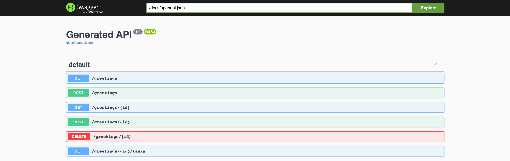

:scrollbar:
:toc2:
:source-highlighter: pygments
:pygments-style: emacs
:linkattrs:


= Kogito: Service Task & CDI Lab

== What is Kogito?

image:images/logo.png[logo]

Kogito is Cloud Native Business Automation. Business Automation covers the application area of business processes, workflows, decisions, rules and optimization. Kogito brings these capabilities to the Cloud Native world by utilizing the latest innovations in the Java landscape, like [Quarkus](https://quarkus.io) and [GraalVM](https://graalvm.org), while building on battle-tested components.

The introduction of the microservices architectural style, and the rapid move to containers and cloud, has introduced new requirements for business applications. Decision and process logic form a large part of an enterprises IT landscape. The move to these new, highly distributed, application environments requires a new form of process automation and decision management. A form of business automation that utilizes concepts like microservices, reactive and event-driven applications, and serverless deployments and execution.

Kogito has been designed with this new world in mind, and provides first-class support for these different paradigms. The Kogito development model morphs to adapt itself to the type of application you are developing.

Kogito is a a Cloud Native Business Automation stack targetted at modern runtimes like [Quarkus](https://quarkus.io) and [Spring Boot](https://spring.io/projects/spring-boot). It's built on battle-tested capabilities like [Drools](https://www.drools.org), [jBPM](https://www.jbpm.org) and [OptaPlanner](https://www.optaplanner.org). Amazingly fast boot time, incredibly low RSS memory (not just heap size!) offering near instant scale up and high density memory utilization in container orchestration platforms like Kubernetes.

=== Kogito ergo Cloud

Kogito is designed from ground up to run at scale on cloud infrastructure. If you think about business automation think about the cloud, as this is where your business logic lives these days. By taking advantage of the latest technologies (Quarkus, knative, etc.), you get amazingly fast boot times and instant scaling on orchestration platforms like Kubernetes.

=== Kogito ergo Domain

Kogito adapts to your business domain rather than the other way around. No more leaking abstraction of the tool into your client applications. Stay focused on what the business is about, instead of being concerned with technology behind it.

=== Kogito ergo Power
Kogito offers a powerful developer experience based on battle-tested components. Achieve instant developer efficiency by having:

* Tooling embeddable wherever you need it
* Code generation taking care of 80% of the work
* Flexibility to customize, only use what you need
* Simplified local development with live reload


=== Goals of this Lab

* Implement a BPMN Service Task using a Context & Dependency Injection (CDI) bean.
* Execute in you local environment.

=== Prerequisits

* Visual Studio Code
* Kogito Tooling for Visual Studio Code
* JDK 11+
* Maven 3.6.3+
* cURL (or another client/tool with which RESTful requests can be sent to the Kogito application)
* GraalVM 20.x (Optional. Required if you want to run a native compilation)


= BPMN2 Service Task and CDI

The BPMN2 specification defines the _Service Task_, an activity node used to invoke an automated application (or service) to execute a task.
In https://kogito.kie.org[Kogito], a _Service Task_ can be implemented using a CDI bean (Quarkus) or a Spring bean (Spring Boot).
In this lab, we will demonstrate this functionality using [Quarkus](https://www.quarkus.io).

Context & Dependency Injection (CDI) support allows developers to easily create process and workflow logic, in a standard Java way for building application logic.
Developers can focus on developing business logic, rather than having to learn new frameworks and extensions for building process logic.
These CDI beans can in their turn be injected with other logic (e.g. Camel for integration, JPA for persistence, SmallRye Reactive Messaging for messaging, etc.).

= The Application We Will Build

The application is a simple text processor application that will convert the passed text to uppercase.

You will implement logic that converts the text to uppercase in a CDI bean.

Let's get started.

= Create a basic project

The easiest way to create a new Kogito project is to execute the Maven command in a terminal:

```console
mvn archetype:generate \
  -DinteractiveMode=false \
  -DarchetypeGroupId=org.kie.kogito \
  -DarchetypeArtifactId=kogito-quarkus-archetype \
  -DarchetypeVersion=0.9.1 \
  -DgroupId=org.acme \
  -DartifactId=service-task-cdi \
  -Dversion=1.0-SNAPSHOT
```

This will use the Kogito Maven Archetype and generate a basic Maven project for you in the `service-task-cdi` subdirectory. The project consists of:

* The Maven structure.
* Example `test-process.bpmn2` BPMN2 process definition.
* An OpenAPI Swagger-UI at `http://localhost:8080/swagger-ui`.

Once the project is generated, open the project in Visual Studio Code:

```
$ cd service-task-cdi
$ code .
```

== BPMN2 Process Definition

The default Kogito application contains a sample process called `test-process.bpmn2`. We will use this file as the base of our project.

In the `src/main/resources` folder of our project, click on the `test-process.bpmn2` file to open the file in the Kogito BPMN editor.


We will use this process definition as the base of our application.

== Running the Application

We will now run the Kogito application in development mode. This allows us to keep the application running while implementing our application logic.
Kogito and Quarkus will _hot reload_ the application when it is accessed and changes have been detected.

Go back to your terminal (or open the integrated terminal in Visual Studio Code).

image:images/vscode-integrated-terminal.png[VSCode POM]

Make sure that you're in the root directory of the `service-task-cdi` project (the directory containing the `pom.xml` file).
We are ready to run our application. Run the following command to start the application in Quarkus development mode:

`$ mvn clean compile quarkus:dev`

When the application has started, you can access the http://localhost:8080/swagger-ui[Swagger UI]

You should see the following page:



It's working!

== Congratulations!

You've seen how to create the skeleton of basic Kogito app, and open the base process definition in the [Kogito Online Tooling](https://kiegroup.github.io/kogito-online/#/). Finally, you've started the application in _Quarkus dev-mode_.

= Create a CDI bean.

To create a new CDI bean, we simply create a new Java file in our `src/main/java` folder. We want to define this bean in the `org.acme` package.
To do this opn the `org/acme` folder in the `src/main/java` folde of your project, and in this folder create a new file called `TextProcessor.java`.

image:images/vscode-new-textprocessor.java[New TextProcessor.java]

We can now add the class definition to our Java file. Replace the content of our newly created `TextProcessor.java` file with the following code snippet:

```java
package org.acme;

import javax.enterprise.context.ApplicationScoped;

/**
 * TextProcessor
 */
//Add CDI annotation here
public class TextProcessor {

//Add toUpper method here

}
```

First, we want to implement our logic. Our process needs to convert all text that is passed to it to uppercase.
Therefore, we create a method that accepts a `String` as input, and returns the converted `String` as its output.
We will call the method `toUpper`.

Add the following code snippet to the `TextProcessor.java` class, at the place of the `//Add toUpper method here` comment:
```java
  public String toUpper(String text) {
    return text.toUpperCase();
  }
```

Finally, we need to add the `@ApplicationScoped` CDI annotation to turn our Java bean into a CDI bean.

Add the following annotation to the `TextProcessor.java` class, at the place of the `//Add CDI annotation here` comment:
```java
@ApplicationScoped
```

Since we still have our app running using in Quarkus dev-mode, when you make these changes and reload the endpoint, Quarkus will notice all of these changes and live-reload them.

== Congratulations!

We've implemented a CDI bean in our Kogito application that can be used as the implementation of a BPMN2 _Service Task_.

= Implementing the BPMN2 ServiceTask

To use the CDI bean we've just created, we need to implement a BPMN2 _ServiceTask_ in our application.

Re-open the `test-process.bpmn` file in the `src/main/resources` folder of your project in VSCode.

== Change Process Name.

We will first change the _name_ and _id_ of the process. This, among other things, controls the name of the RESTful resource (URL) that will be generated for this process by Kogito.

In the BPMN editor, click on the pencil icon in the upper-right corner to open the properties panel.


Change the _Name_ and _ID_ of the process to `text_processor`.


== Add Process Variable

Our application's functionality is to take an input `String` and convert it to uppercase. So, our process definition requires a process variable of type `String` to carry the data through the process.

Scroll down in the properties panel until you see the section _Process Data_. Expand this section and click on the _+_ sign to add a new process variable. Give the variable the name `mytext` and the type `String`. Leave the _KPI_ checkbox unchecked.


== Create Service Task

In the diagram, double-click on the `Hello` _Script Task_ to change the name of the node. Change the name to `Process Text`.


Next, we need to change the node from a _Script Task_ to a _Service Task_. To do this, click on the node, hoover over the gear icon in the lower-left corner of the node, and select _Convert into Service Task_ in the menu.


== Configuring the Service Task

We can now configure the _Service Task_ so that it calls the `toUpper` method of our `TextProcessor` CDI bean, pass the `mytext` process variable to it, and map the result back.
To do this, select the `Process Text` _Service Task_, and open the properties panel on the right side of the screen. Expand the _Implementation/Execution_ section. Set the following values:

* Implementation: `Java`
* Interface: `org.acme.TextProcessor`
* Operation: `toUpper`


With the implementation configuration set, we can now configure the data _Assignments_. In the properties panel, click on the pencil icon in the _Assignments_ section.
In the form that opens, add the following _input_ and _output_ data assignments.

image:images/kogito-service-task-cdi-service-task-data-assignment.png[Service Task Data Assignment]

Note that the _Name_ of the input assignment is the name of the `toUpper` method argument in our `TextProcessor` CDI bean.

We have now implemented our process definition. Make sure to save the file.

== Test the process

Because we're using the hot-reload functionality of Kogito and Quarkus, we don't need to recompile and restart our application after we've implemented our functionality.
We can simply send a new request, and the application will hot/live reload and serve the request. With the following request, we send the text `hello` to our process:

If you've cURL installed on your system, execute the following command in a terminal. This will send a request with the payload `"mytext": "hello"` to our Kogito service.

`$ curl -X POST "http://localhost:8080/text_processor" -H "accept: application/json" -H "Content-Type: application/json" -d "{ \"mytext\": \"hello\"}"`

The reply will be the same data converted to _uppercase_.

== Congratulations!

In this scenario you've implemented the logic of a BPMN _Service Task_ node using CDI. There is much more to Kogito than CDI and hot-reload, so keep on exploring additional scenarios to learn more, and be sure to visit [kogito.kie.org](https://kogito.kie.org) to learn even more about the architecture and capabilities of this exciting new framework for Cloud Native Business Automation.

In this lab, we've learned how to implement the logic of a Kogito BPMN2 Service Task with a CDI bean.
A foundational aspect of Kogito is that it is developer focussed.
By integrating with various Java standards and de-facto standards, Kogito allows developers of business applications to use their existing skills and tools to build cloud-native process, worklfow, decision and rules applications.
