:scrollbar:
:toc2:
:source-highlighter: pygments
:pygments-style: emacs
:linkattrs:


= Kogito: Service Orchestration

== What is Kogito?

image:images/logo.png[logo]

Kogito is Cloud Native Business Automation. Business Automation covers the application area of business processes, workflows, decisions, rules and optimization. Kogito brings these capabilities to the Cloud Native world by utilizing the latest innovations in the Java landscape, like [Quarkus](https://quarkus.io) and [GraalVM](https://graalvm.org), while building on battle-tested components.

The introduction of the microservices architectural style, and the rapid move to containers and cloud, has introduced new requirements for business applications. Decision and process logic form a large part of an enterprises IT landscape. The move to these new, highly distributed, application environments requires a new form of process automation and decision management. A form of business automation that utilizes concepts like microservices, reactive and event-driven applications, and serverless deployments and execution.

Kogito has been designed with this new world in mind, and provides first-class support for these different paradigms. The Kogito development model morphs to adapt itself to the type of application you are developing.

Kogito is a a Cloud Native Business Automation stack targetted at modern runtimes like [Quarkus](https://quarkus.io) and [Spring Boot](https://spring.io/projects/spring-boot). It's built on battle-tested capabilities like [Drools](https://www.drools.org), [jBPM](https://www.jbpm.org) and [OptaPlanner](https://www.optaplanner.org). Amazingly fast boot time, incredibly low RSS memory (not just heap size!) offering near instant scale up and high density memory utilization in container orchestration platforms like Kubernetes.

=== Kogito ergo Cloud

Kogito is designed from ground up to run at scale on cloud infrastructure. If you think about business automation think about the cloud, as this is where your business logic lives these days. By taking advantage of the latest technologies (Quarkus, knative, etc.), you get amazingly fast boot times and instant scaling on orchestration platforms like Kubernetes.

=== Kogito ergo Domain

Kogito adapts to your business domain rather than the other way around. No more leaking abstraction of the tool into your client applications. Stay focused on what the business is about, instead of being concerned with technology behind it.

=== Kogito ergo Power
Kogito offers a powerful developer experience based on battle-tested components. Achieve instant developer efficiency by having:

* Tooling embeddable wherever you need it
* Code generation taking care of 80% of the work
* Flexibility to customize, only use what you need
* Simplified local development with live reload


=== Goals of this Lab

* Call a RESTful service from a Kogito process using the JAX-RS standard
* Call a RESTful service from a Kogito process using Apache Camel as the integration layer.
* Execute in you local environment.

=== Prerequisits

* Visual Studio Code
* Kogito Tooling for Visual Studio Code
* JDK 11
* Maven 3.6.3+
* cURL (or another client/tool with which RESTful requests can be sent to the Kogito application)
* GraalVM 20.x (Optional. Required if you want to run a native compilation)

= BPMN2 and Services

The BPMN2 specification defines the _Service Task_, an activity node used to invoke an automated application (or service) to execute a task.
In [Kogito](https://kogito.kie.org), a _Service Task_ can be implemented using a CDI bean (Quarkus) or a Spring bean (Spring Boot).

A CDI implementation of a _Service Task_ allows us to inject various capabilities and functionality into the implementation to allow us to,
for example, define the integration logic to connect to external systems. In this lab we will look at two options to integrate with RESTful microservice.
First, we will use the MicroProfile Rest Client to call an external microservice.
After that, we will replace this logic with an [Apache Camel](https://camel.apache.org/) route to call the same service.
Note that the integration with Camel is extremely interesting, as Camel provides a vast array of connectors to connect to virtually any type of external system (e.g. SalesForce, Kafka, Twitter, SAP, etc.).


= The Application We Will Build

The application is a simple workflow application that retrieves the coffee menu from a RESTful microservice.
This microservice is built in Quarkus and will be provided.

You will implement logic that calls this microservice's GET operation to retrieve the coffee menu.

Let's get started.

= Create a basic project

To create a new Quarkus project with the Kogito extension, execute the following Maven command in a terminal

```console
mvn io.quarkus:quarkus-maven-plugin:1.4.1.Final:create \
    -DprojectGroupId=org.acme \
    -DprojectArtifactId=coffeeshop \
    -Dextensions="org.kie.kogito:kogito-quarkus,io.quarkus:quarkus-smallrye-openapi"
```


This uses the Quarkus Maven plugin and generates a basic Maven project for us in the `coffeeshop` subdirectory which contains:

* The project's Maven structure.
* An OpenAPI Swagger-UI at `http://localhost:8080/swagger-ui`.

NOTE: In this lab we're using the Quarkus Maven plugin, rather that the Kogito Maven archetype, to create our application. The reason for this is that this provides with a project that imports the Quarkus BOM (Bill of Material), that provides the Quarkus Camel dependencies we will need later in this lab.

Once the project is generated, open the project in Visual Studio Code:

```
$ cd coffeeshop
$ code .
```

Open the `pom.xml` file. We will find the import of the Quarkus BOM which enables us to omit the version of the Kogito and Quarkus dependencies.
In addition, we can see the `quarkus-maven-plugin`, which is responsible for packaging of the application and which allows us to start the application in Quarkus development mode.


== Running the Application

We will now run the Kogito application in development mode. This allows us to keep the application running while implementing our application logic.
Kogito and Quarkus will _hot reload_ the application when it is accessed and changes have been detected.

Go back to your terminal (or open the integrated terminal in Visual Studio Code).

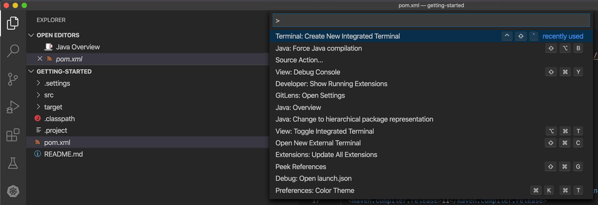

Make sure that you're in the root directory of the `coffeeshop` project (the directory containing the `pom.xml` file).
We are ready to run our application. Run the following command to start the application in Quarkus development mode:

`$ mvn clean compile quarkus:dev`

When the application has started, you can access the http://localhost:8080/swagger-ui[Swagger UI]

You should see the following page:

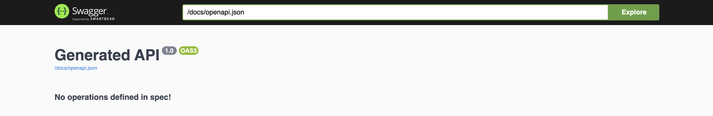

It's working!

We can now stop the application using `CTRL-C`.

= The CoffeeService

The goal of this lab is for our process to call an external microservice using REST from a BPMN2 Service Task node.
So we need to have a RESTful microservice that we can call.

As part of this lab, we've provided a Quarkus-based microservice that serves as our Coffee Menu Service.
The service provides a simple RESTful endpoint that returns a list of coffees on the menu, as well as the details of a single coffee item that can be selected by name.

To run the service, we first need to compile and package it.

Execute the following command in a terminal. Make sure that you're *not* in the `coffeeshop` project directory, as we want to clone this project in its own directory.

`$ git clone https://github.com/DuncanDoyle/coffeeservice-quarkus.git`

Once the project is cloned, navigate into the directory

`$ cd coffeeservice-quarkus`

To package the project, execute the following command:

`$ mvn clean package`

This creates a new runnable Quarkus JAR file. Execute the following command to run the application:

`$ java -jar target/coffeeservice-quarkus-1.0-SNAPSHOT-runner.jar`

With the microservice running, we can access its http://localhost:8090/swagger-ui[Swagger-UI here].

If you've cURL installed on your system, execute the following command in a terminal. This will retrieve the list of coffees.

`$ curl -X GET "http://localhost:8090/coffee" -H "accept: application/json" -d "{}"`

You should see the following output:

```console
[{"id":1,"name":"espresso-arabica","description":"arabica beans","price":2.0},{"id":2,"name":"espresso-robusta","description":"robusta beans","price":2.0},{"id":3,"name":"latte-arabica","description":"arabica beans, full fat bio milk","price":3.0}]
```

== Congratulations!

We've seen how to create the skeleton of basic Kogito app, package it and start it up very quickly in `quarkus:dev` mode. We also packaged and started a Quarkus service that we will consume with our Kogito application on the next steps.

In the next step we'll create a BPMN2 process definition for our coffeeshop.


= Define the Process

We will now create the initial part of our _coffeeshop_ process.
This will be a very simple process that only retrieves the available types of coffees from the _CoffeeMenuService_.
This scenario is only intended to demonstrate the capabilities of Kogito.
The rest of our _coffeeshop process_ would for example include a _UserTask_ to select the type of coffee, selection of a payment method, integration with an external payment provider, and an event to the barista to make the requested coffee.

== Create a process definition

Let’s modify the application and add our simple _coffeeshop process_.

We create a simple process that will look like this:

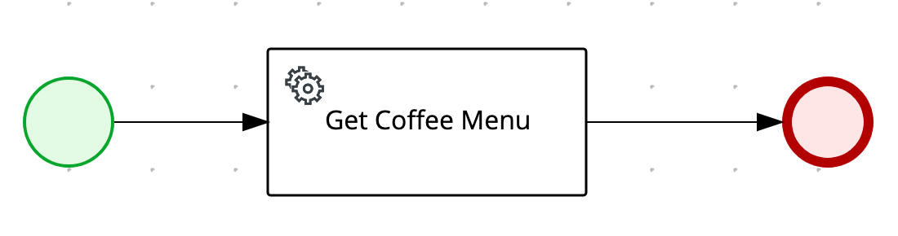

In the `src/main/resources` folder of your project, create a new file called `coffeeshop-process.bpmn`.

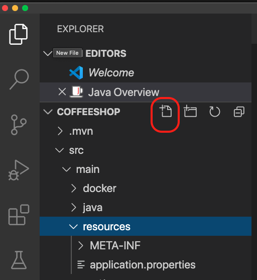

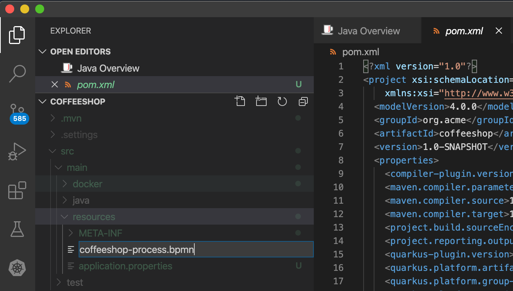

BPMN2 allows us to define a graphical representation of a process (or workflow), and as such, we need a BPMN2 editor to implement our process.
Opening a BPMN file in VSCode will automatically open this file in the Kogito BPMN editor (given that we've installed the Kogito extension in VSCode).
Kogito also provides an online BPMN2 editor that we can use to build our process.

Implement the process as follows (note that we can also bypass this step and simply copy the pre-made BPMN2 file provided below):

* Click the pencil icon on the right-hand-side of the screen to open the property panel. Set the following name, id and package:
** Name: `coffeeshop`
** ID: `coffeeshop`
** Package: `org.acme`
  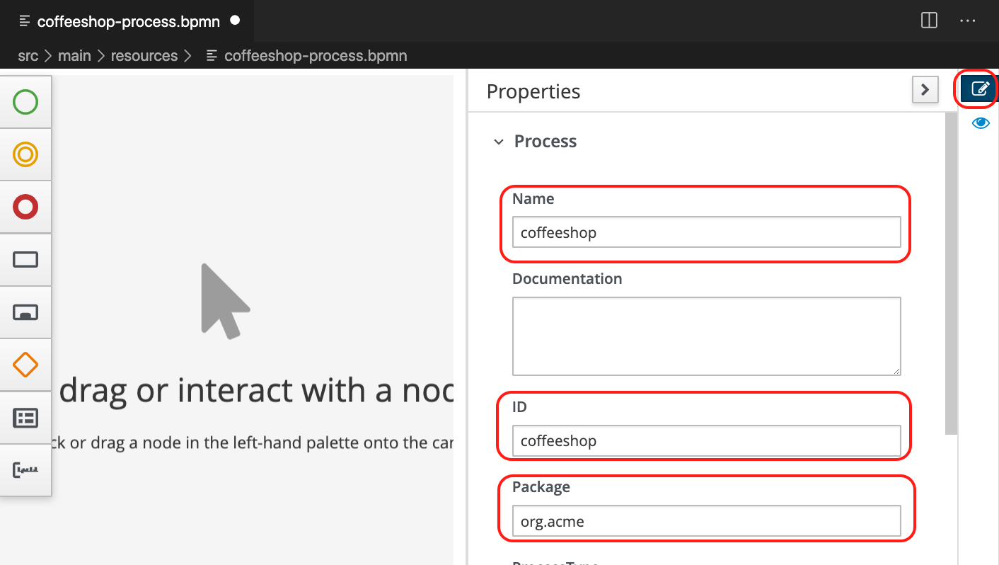

* Expand the _Process Data_ section and add the following _Process Variable_:
** Name: `coffees`
** Data Type: `java.util.Collection`
* Add the tag `output` to this variable. This controls, among other things, the generation of our RESTful API. I.e., a variable tagged with `output` will not be part of the input model, and thus does not need to be passed when starting a process. It is however part of the output model, and hence will be returned to the client as a response of the RESTful call.
  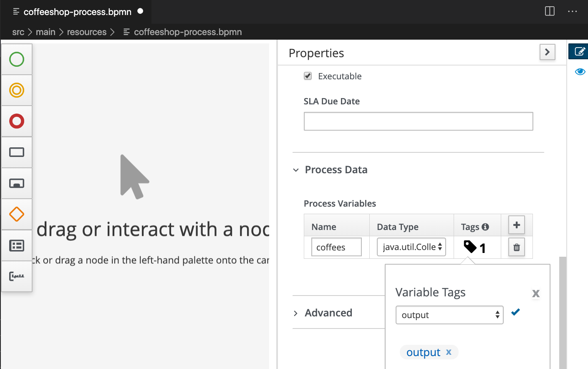

* Drag and drop on the canvas, a `StartEvent` node.
  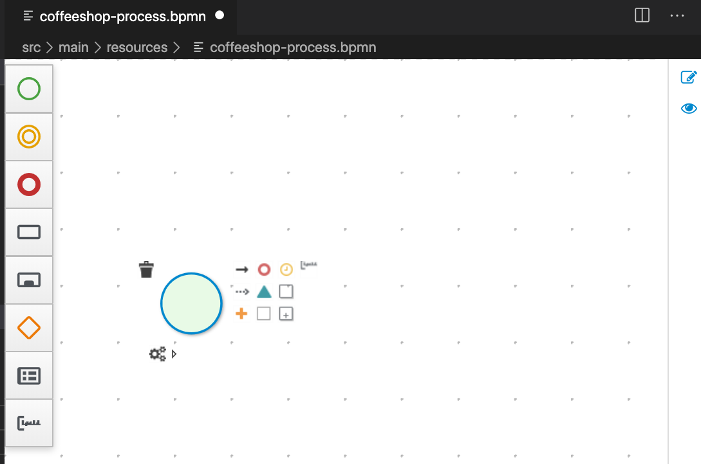

* Add a Service Task node.
  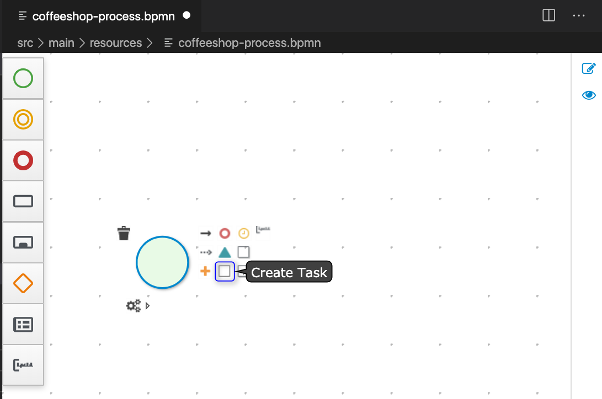
  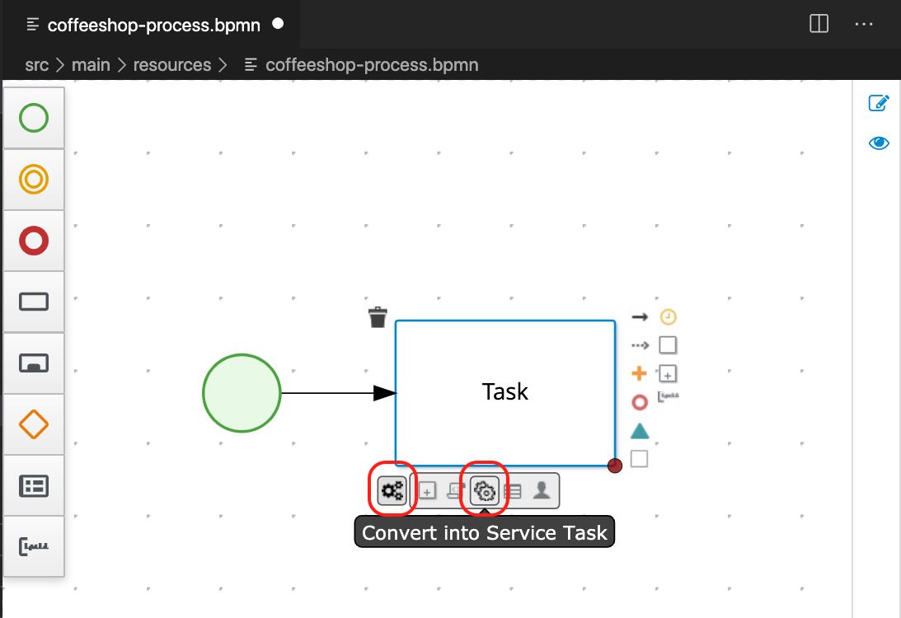

* Double click the Service Task, and give it the name: `Get Coffee Menu`
* With the Service Task selected, open the property panel on the right-hand-side of the screen by clicking the pencil icon.
* Expand the _Implementation/Execution_ section. Set the following values:
** Implementation: `Java`
** Interface: `org.acme.service.CoffeeService`
** Operation: `getCoffees`
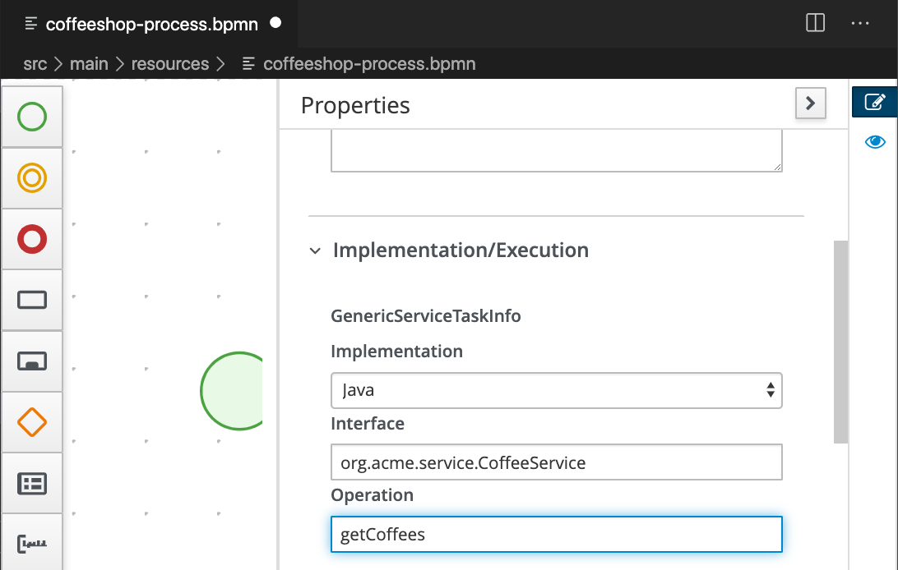

** Still on the properties panel, on the Service Task Assignments, add one `Data Outputs and Assignments` :
** Name: coffees
** Data Type: java.util.Collection
** Target: coffees
  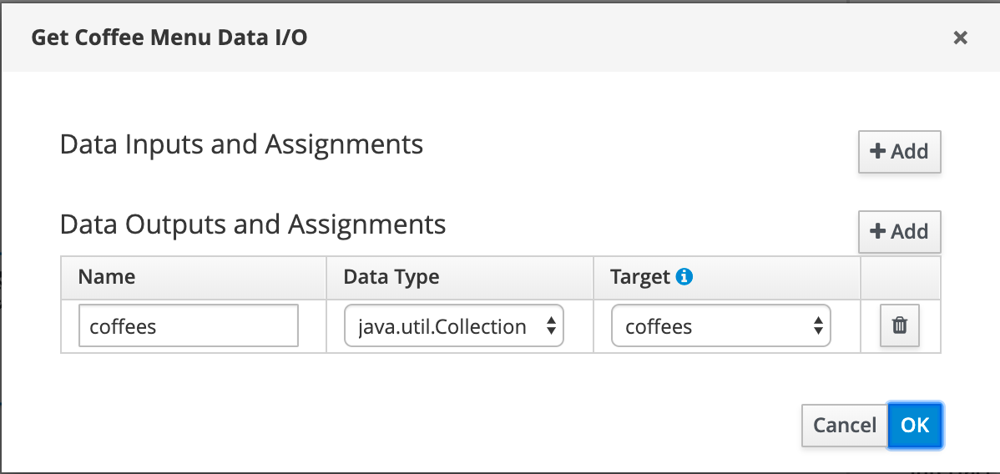

* Click on the Service Task and add a new EndEvent node.
  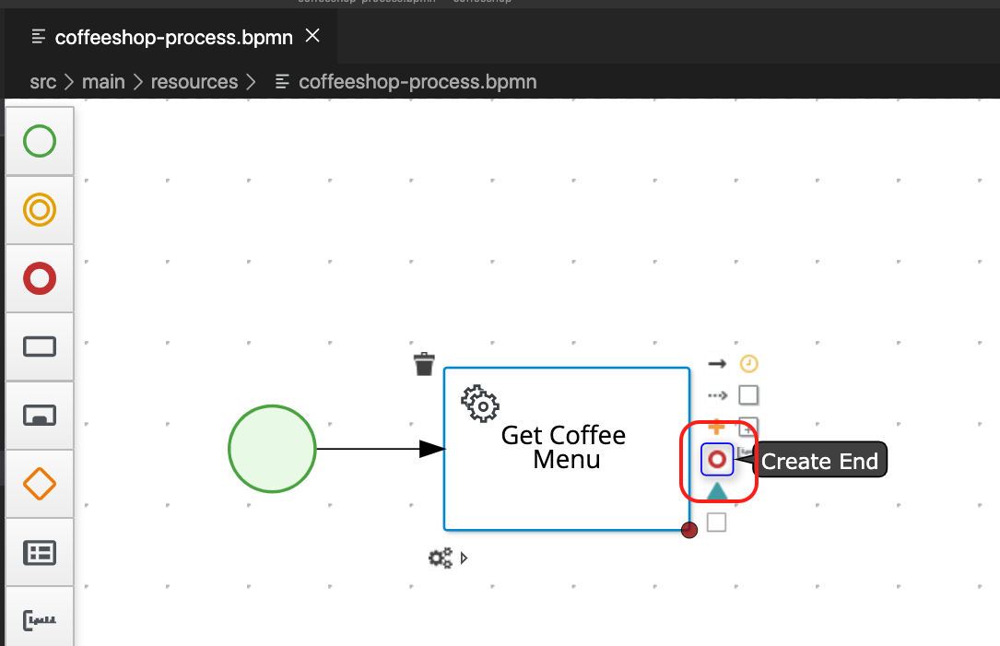
After we've defined our process, make sure to save the file.

*Alternatively*, you can copy the following BPMN2 definition to the BPMN file.

*TIP*: if you find issues with VSCode while trying to open the BPMN in the text editor, follow these steps:

  1. Open the BPMN file using the designer
  2. Open the `Command Pallet` (e.g. cmd+shift+p), type `reopen` and select `File: Reopen With...`
  3. Next, select `Text Editor`

Paste the following XML in the Text Editor and save the file.

```xml
<bpmn2:definitions xmlns:bpmn2="http://www.omg.org/spec/BPMN/20100524/MODEL" xmlns:bpmndi="http://www.omg.org/spec/BPMN/20100524/DI" xmlns:bpsim="http://www.bpsim.org/schemas/1.0" xmlns:dc="http://www.omg.org/spec/DD/20100524/DC" xmlns:di="http://www.omg.org/spec/DD/20100524/DI" xmlns:drools="http://www.jboss.org/drools" id="_F5Ou4HNMEDig17XG0NHLjQ" exporter="jBPM Process Modeler" exporterVersion="2.0" targetNamespace="http://www.omg.org/bpmn20">
  <bpmn2:itemDefinition id="_coffeesItem" structureRef="java.util.Collection"/>
  <bpmn2:itemDefinition id="__3CDC6E61-DCC5-4831-8BBB-417CFF517CB0_coffeesOutputXItem" structureRef="java.util.Collection"/>
  <bpmn2:interface id="_3CDC6E61-DCC5-4831-8BBB-417CFF517CB0_ServiceInterface" name="org.acme.service.CoffeeService" implementationRef="org.acme.service.CoffeeService">
    <bpmn2:operation id="_3CDC6E61-DCC5-4831-8BBB-417CFF517CB0_ServiceOperation" name="getCoffees" implementationRef="getCoffees"/>
  </bpmn2:interface>
  <bpmn2:process id="coffeeshop" drools:packageName="org.acme" drools:version="1.0" drools:adHoc="false" name="coffeeshop" isExecutable="true" processType="Public">
    <bpmn2:property id="coffees" itemSubjectRef="_coffeesItem" name="coffees">
      <bpmn2:extensionElements>
        <drools:metaData name="customTags">
          <drools:metaValue><![CDATA[output]]></drools:metaValue>
        </drools:metaData>
      </bpmn2:extensionElements>
    </bpmn2:property>
    <bpmn2:sequenceFlow id="_323FD4C9-FC3D-404F-9156-E3F83B45A799" sourceRef="_3CDC6E61-DCC5-4831-8BBB-417CFF517CB0" targetRef="_D74E4311-5CAB-4CBE-9B83-C12961961633">
      <bpmn2:extensionElements>
        <drools:metaData name="isAutoConnection.source">
          <drools:metaValue><![CDATA[true]]></drools:metaValue>
        </drools:metaData>
        <drools:metaData name="isAutoConnection.target">
          <drools:metaValue><![CDATA[true]]></drools:metaValue>
        </drools:metaData>
      </bpmn2:extensionElements>
    </bpmn2:sequenceFlow>
    <bpmn2:sequenceFlow id="_00AB4A77-D70F-4086-8BA6-57DD017A5323" sourceRef="_75AC8C0C-CFBD-4ADF-A3B4-83AB90581A73" targetRef="_3CDC6E61-DCC5-4831-8BBB-417CFF517CB0">
      <bpmn2:extensionElements>
        <drools:metaData name="isAutoConnection.source">
          <drools:metaValue><![CDATA[true]]></drools:metaValue>
        </drools:metaData>
        <drools:metaData name="isAutoConnection.target">
          <drools:metaValue><![CDATA[true]]></drools:metaValue>
        </drools:metaData>
      </bpmn2:extensionElements>
    </bpmn2:sequenceFlow>
    <bpmn2:endEvent id="_D74E4311-5CAB-4CBE-9B83-C12961961633">
      <bpmn2:incoming>_323FD4C9-FC3D-404F-9156-E3F83B45A799</bpmn2:incoming>
    </bpmn2:endEvent>
    <bpmn2:serviceTask id="_3CDC6E61-DCC5-4831-8BBB-417CFF517CB0" drools:serviceimplementation="Java" drools:serviceinterface="org.acme.service.CoffeeService" drools:serviceoperation="getCoffees" name="Get Coffee Menu" implementation="Java" operationRef="_3CDC6E61-DCC5-4831-8BBB-417CFF517CB0_ServiceOperation">
      <bpmn2:extensionElements>
        <drools:metaData name="elementname">
          <drools:metaValue><![CDATA[Get Coffee Menu]]></drools:metaValue>
        </drools:metaData>
      </bpmn2:extensionElements>
      <bpmn2:incoming>_00AB4A77-D70F-4086-8BA6-57DD017A5323</bpmn2:incoming>
      <bpmn2:outgoing>_323FD4C9-FC3D-404F-9156-E3F83B45A799</bpmn2:outgoing>
      <bpmn2:ioSpecification>
        <bpmn2:dataOutput id="_3CDC6E61-DCC5-4831-8BBB-417CFF517CB0_coffeesOutputX" drools:dtype="java.util.Collection" itemSubjectRef="__3CDC6E61-DCC5-4831-8BBB-417CFF517CB0_coffeesOutputXItem" name="coffees"/>
        <bpmn2:outputSet>
          <bpmn2:dataOutputRefs>_3CDC6E61-DCC5-4831-8BBB-417CFF517CB0_coffeesOutputX</bpmn2:dataOutputRefs>
        </bpmn2:outputSet>
      </bpmn2:ioSpecification>
      <bpmn2:dataOutputAssociation>
        <bpmn2:sourceRef>_3CDC6E61-DCC5-4831-8BBB-417CFF517CB0_coffeesOutputX</bpmn2:sourceRef>
        <bpmn2:targetRef>coffees</bpmn2:targetRef>
      </bpmn2:dataOutputAssociation>
    </bpmn2:serviceTask>
    <bpmn2:startEvent id="_75AC8C0C-CFBD-4ADF-A3B4-83AB90581A73">
      <bpmn2:outgoing>_00AB4A77-D70F-4086-8BA6-57DD017A5323</bpmn2:outgoing>
    </bpmn2:startEvent>
  </bpmn2:process>
  <bpmndi:BPMNDiagram>
    <bpmndi:BPMNPlane bpmnElement="coffeeshop">
      <bpmndi:BPMNShape id="shape__75AC8C0C-CFBD-4ADF-A3B4-83AB90581A73" bpmnElement="_75AC8C0C-CFBD-4ADF-A3B4-83AB90581A73">
        <dc:Bounds height="56" width="56" x="176" y="198"/>
      </bpmndi:BPMNShape>
      <bpmndi:BPMNShape id="shape__3CDC6E61-DCC5-4831-8BBB-417CFF517CB0" bpmnElement="_3CDC6E61-DCC5-4831-8BBB-417CFF517CB0">
        <dc:Bounds height="90" width="195" x="326" y="181"/>
      </bpmndi:BPMNShape>
      <bpmndi:BPMNShape id="shape__D74E4311-5CAB-4CBE-9B83-C12961961633" bpmnElement="_D74E4311-5CAB-4CBE-9B83-C12961961633">
        <dc:Bounds height="56" width="56" x="641" y="198"/>
      </bpmndi:BPMNShape>
      <bpmndi:BPMNEdge id="edge_shape__75AC8C0C-CFBD-4ADF-A3B4-83AB90581A73_to_shape__3CDC6E61-DCC5-4831-8BBB-417CFF517CB0" bpmnElement="_00AB4A77-D70F-4086-8BA6-57DD017A5323">
        <di:waypoint x="232" y="226"/>
        <di:waypoint x="326" y="226"/>
      </bpmndi:BPMNEdge>
      <bpmndi:BPMNEdge id="edge_shape__3CDC6E61-DCC5-4831-8BBB-417CFF517CB0_to_shape__D74E4311-5CAB-4CBE-9B83-C12961961633" bpmnElement="_323FD4C9-FC3D-404F-9156-E3F83B45A799">
        <di:waypoint x="521" y="226"/>
        <di:waypoint x="732.5" y="198"/>
      </bpmndi:BPMNEdge>
    </bpmndi:BPMNPlane>
  </bpmndi:BPMNDiagram>
  <bpmn2:relationship type="BPSimData">
    <bpmn2:extensionElements>
      <bpsim:BPSimData>
        <bpsim:Scenario id="default" name="Simulationscenario">
          <bpsim:ScenarioParameters/>
          <bpsim:ElementParameters elementRef="_75AC8C0C-CFBD-4ADF-A3B4-83AB90581A73">
            <bpsim:TimeParameters>
              <bpsim:ProcessingTime>
                <bpsim:NormalDistribution mean="0" standardDeviation="0"/>
              </bpsim:ProcessingTime>
            </bpsim:TimeParameters>
          </bpsim:ElementParameters>
          <bpsim:ElementParameters elementRef="_3CDC6E61-DCC5-4831-8BBB-417CFF517CB0">
            <bpsim:TimeParameters>
              <bpsim:ProcessingTime>
                <bpsim:NormalDistribution mean="0" standardDeviation="0"/>
              </bpsim:ProcessingTime>
            </bpsim:TimeParameters>
            <bpsim:ResourceParameters>
              <bpsim:Availability>
                <bpsim:FloatingParameter value="0"/>
              </bpsim:Availability>
              <bpsim:Quantity>
                <bpsim:FloatingParameter value="0"/>
              </bpsim:Quantity>
            </bpsim:ResourceParameters>
            <bpsim:CostParameters>
              <bpsim:UnitCost>
                <bpsim:FloatingParameter value="0"/>
              </bpsim:UnitCost>
            </bpsim:CostParameters>
          </bpsim:ElementParameters>
        </bpsim:Scenario>
      </bpsim:BPSimData>
    </bpmn2:extensionElements>
    <bpmn2:source>_F5Ou4HNMEDig17XG0NHLjQ</bpmn2:source>
    <bpmn2:target>_F5Ou4HNMEDig17XG0NHLjQ</bpmn2:target>
  </bpmn2:relationship>
</bpmn2:definitions>
```

Note that we've not yet implemented the required CDI beans, therefore we cannot test our process yet. We will implement this CDI bean in the following step.

== Congratulations!

We've created the coffeeshop business process in our Kogito application using BPMN2. In the next step, we will implement the CDI bean that our Service Task is referencing.

= JAX-RS REST Client

We will now implement the CDI bean that calls our RESTful service using a JAX-RS Client.

== REST Client Dependencies

We first add the required dependencies to our pom.xml. Because we will use the `quarkus-rest-client`, we need to add its dependency to our POM.

In a terminal, in the root of your `coffeeshop-service` project, execute the following command to add the `quarkus-rest-client` extension:

`$ mvn quarkus:add-extension -Dextensions=io.quarkus:quarkus-rest-client`

In Visual Studio Code, open the `pom.xml` file of your `coffeeshop-service` project and observe that the required dependencies have been added.

```
<dependency>
  <groupId>io.quarkus</groupId>
  <artifactId>quarkus-rest-client</artifactId>
</dependency>
```

== JAX-RS Client

Our Service Task node in our process will call the method `getCoffees` of a CDI bean called `CoffeeService`. Let's first create the skeleton of that bean.

We will create a new `CoffeeService.java` file in the `org.acme` package. So, we first need to create this package.
In the `src/main/java` folder of our `coffeshop-service`, create a new directory `org/acme/service` directory structure.

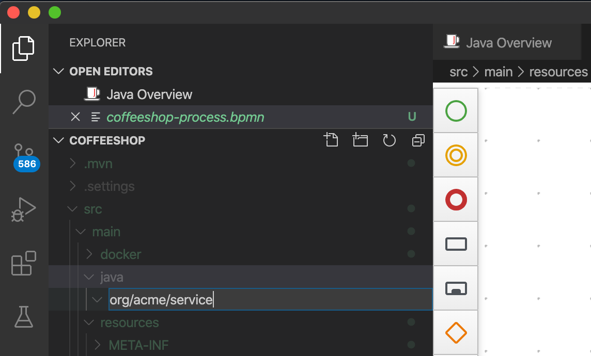

In this new directory, create a new `CoffeeService.java` file.

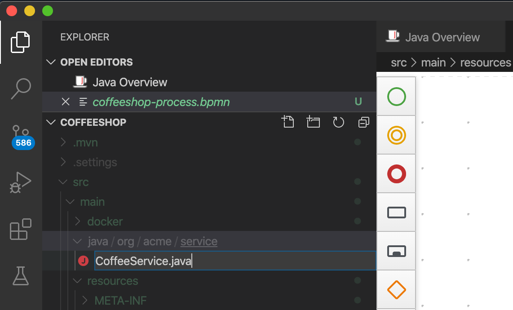

Replace the content of this new file with the following code snippet:

```java
package org.acme.service;

import java.util.Collection;

import javax.enterprise.context.ApplicationScoped;
import javax.inject.Inject;

import org.acme.coffeeservice.client.CoffeeResource;
import org.acme.model.Coffee;

import org.eclipse.microprofile.rest.client.inject.RestClient;

@ApplicationScoped
public class CoffeeService {

//Add RestClient annotations
//Add RestClient attribute

    public Collection<Coffee> getCoffees() {
      return null;
    }

}
```

With the CDI bean skeleton implemented, we can focus on the domain model and the JAX-RS interface from which our rest client is generated.

Our domain model is simply the `Coffee` class that's also used by the CoffeeService we started earlier.
This class lives in the package `org.acme.model`. We therefore first need to create this package. In the `org/acme` folder in `src/main/java`, create a new directory called `model`.

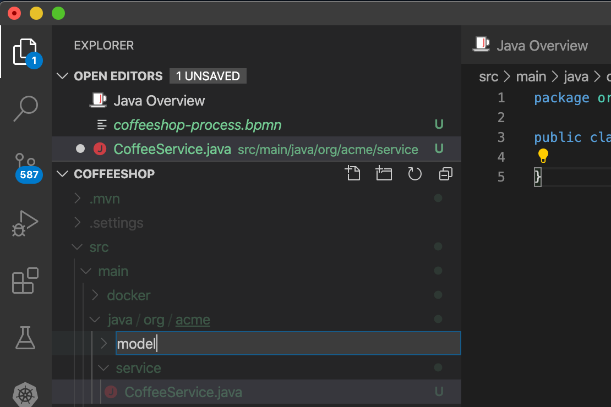

Within this package, create a new file called `Coffee.java`:

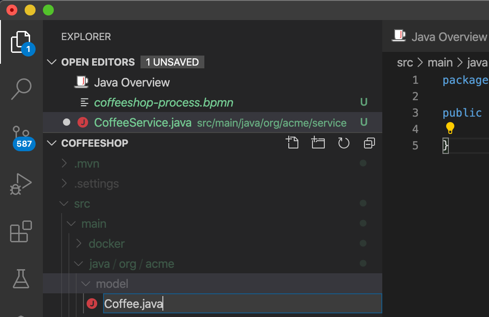

Replace the content of this new `Coffee.java` file with the following code snippet:
```java
package org.acme.model;

public class Coffee {

    private long id;

    private String name;

    private String description;

    private double price;

    public Coffee() {
    }

    public Coffee(final long id, final String name, final String description, final double price) {
        this.id = id;
        this.name = name;
        this.description = description;
        this.price = price;
    }

    public long getId() {
        return id;
    }

    public String getName() {
        return name;
    }

    public String getDescription() {
        return description;
    }

    public double getPrice() {
        return price;
    }

}
```

With our domain model implemented, we can now implement the JAX-RS interface definition.
This is actually the same JAX-RS interface definition that is used in the _CoffeeService_.
The only difference is that we annotate this interface with the `@RegisterRestClient(configKey = "coffeeresource")` annotation to register it as a Rest client.

Our JAX-RS client will be defined in the package `org.acme.coffeeservice.client`. Let's create that package by addin the `coffeeservice/client` directory structure to the `org/acme` folder `src/main/java`:

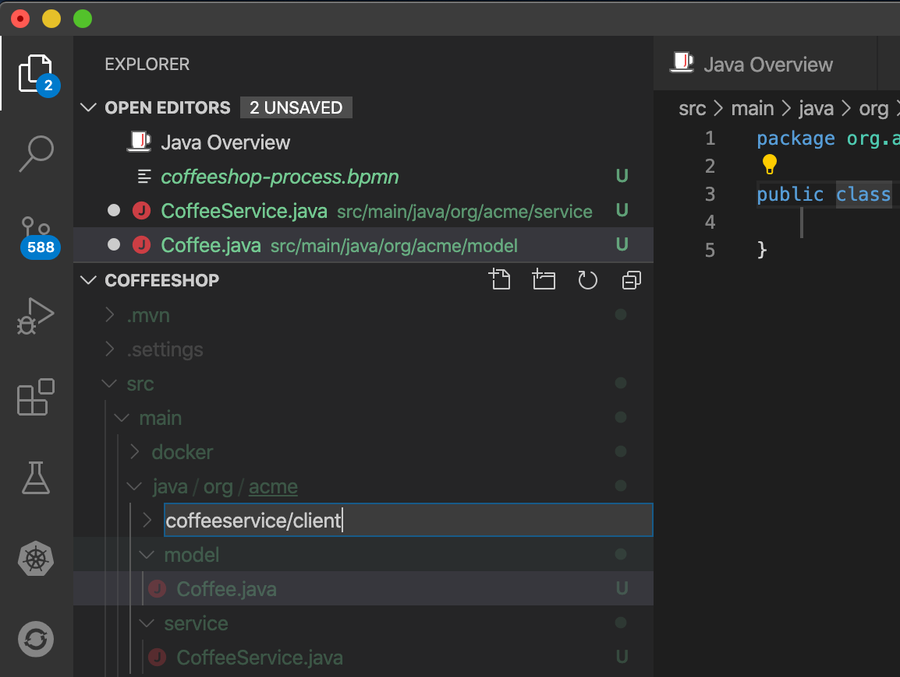

Now, we can create the `CoffeeResource.java` file in the `org.acme.coffeeservice.client` package in the `src/main/java` folder.

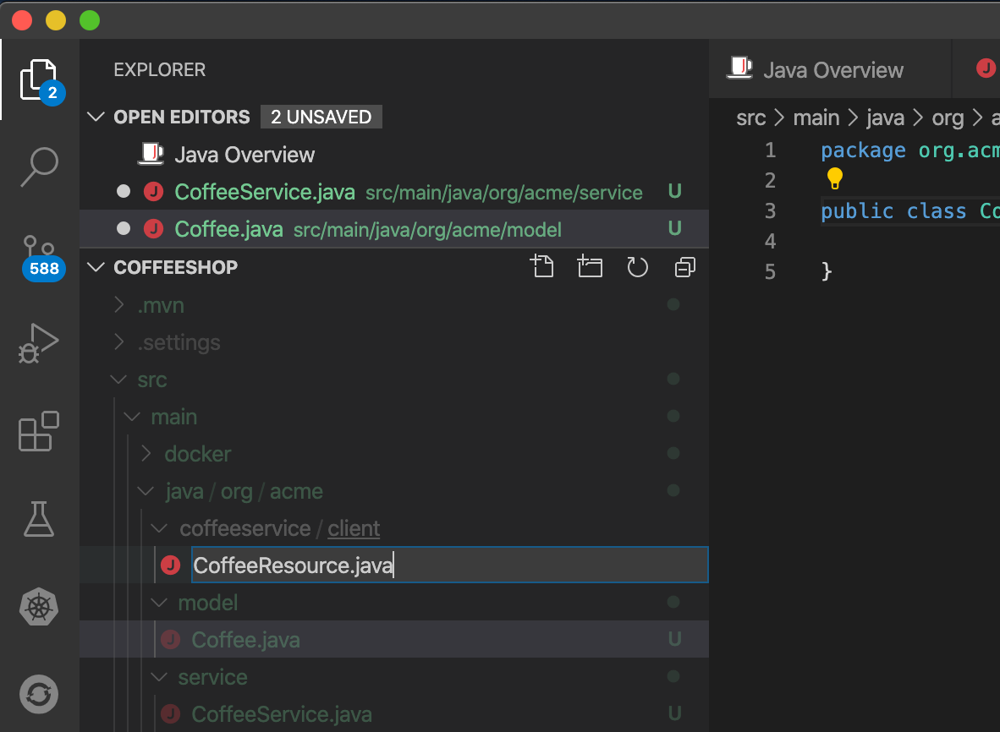

Replace the content of our new `CoffeeResource.java` file with the following content:

```java
package org.acme.coffeeservice.client;

import java.util.Collection;

import javax.ws.rs.GET;
import javax.ws.rs.Path;
import javax.ws.rs.PathParam;
import javax.ws.rs.Produces;
import javax.ws.rs.core.MediaType;

import org.acme.model.Coffee;

import org.eclipse.microprofile.rest.client.inject.RegisterRestClient;

@RegisterRestClient(configKey = "coffeeresource")
@Path("/coffee")
public interface CoffeeResource {

    @GET
    @Produces(MediaType.APPLICATION_JSON)
    public Collection<Coffee> getCoffees();

    @GET
    @Path("/{name}")
    @Produces(MediaType.APPLICATION_JSON)
    public Coffee getCoffee(@PathParam("name") String name);

}
```

With our domain model and JAX-RS client interface defined, we can now add the logic to our CDI bean to use the JAX-RS client.
Open the `CoffeeService.java` file we created earlier.

First, we inject the `CoffeeResource` class into the service.

Add the following code snippet to the `CoffeeService.java` class, at the place of the `//Add RestClient attribute` comment:

```java
    CoffeeResource coffeeResource;
```

NOTE: This attribute is _package-private_. This is recommended by Quarkus, as this enables Quarkus to do the injection without the need for reflection

Next, we add the annotations to this attribute to inject the REST client. We need two annotations.
First we need the `@Inject` annotation, but because we want to inject the generated REST client project (generated from the JAX-RS interface we created earlier),
we also need to add the `@RestClient` annotation.

Add the following code snippet to the `CoffeeService.java` class, at the place of the `//Add RestClient annotations` comment:
```java
    @Inject
    @RestClient
```

Finally, we call our REST client to retrieve the list of coffees from our service.
We add some logging to our application to show that our CDI is actually being called (just for demonstration purposes).

Add the following code snippet to the `CoffeeService.java` class in the method `getCoffees`, replacing the `return null;` statement:

```java
    System.out.println("Kogito calling our CoffeeService microservice!");
    return coffeeResource.getCoffees();
```

== Configuring the REST client
With our code completed, we now only need to add some configuration options to our `application.properties` file to instruct our REST client which endpoint it needs to call.

In VSCode, open the `application.properties` file in the `src/main/resources` folder.

Replace the content of the file with the following configuration.

```
#
# Copyright 2020 Red Hat, Inc. and/or its affiliates.
#
# Licensed under the Apache License, Version 2.0 (the "License");
# you may not use this file except in compliance with the License.
# You may obtain a copy of the License at
#
#     http://www.apache.org/licenses/LICENSE-2.0
#
# Unless required by applicable law or agreed to in writing, software
# distributed under the License is distributed on an "AS IS" BASIS,
# WITHOUT WARRANTIES OR CONDITIONS OF ANY KIND, either express or implied.
# See the License for the specific language governing permissions and
# limitations under the License.
#

#https://quarkus.io/guides/openapi-swaggerui
quarkus.smallrye-openapi.path=/docs/openapi.json
quarkus.swagger-ui.always-include=true

kogito.service.url=http://localhost:8080

#CoffeeResource
coffeeresource/mp-rest/url=http://localhost:8090
coffeeresource/mp-rest/scope=javax.inject.Singleton
```

Notice that we use the key `coffeeresource` to configure our client, and don't specify its full class name.
This is possible because we defined this name as the `configKey` in `@RegisterRestClient` annotation on the JAX-RS interface.

== Starting the Application

With our code implemented, we can now start the application in Quarkus dev-mode by executing the following Maven command:

`$ mvn clean compile quarkus:dev`

This downloads the new dependencies and starts our application in Quarkus development mode. If everything is correct you should see the following message:

```
__  ____  __  _____   ___  __ ____  ______
 --/ __ \/ / / / _ | / _ \/ //_/ / / / __/
 -/ /_/ / /_/ / __ |/ , _/ ,< / /_/ /\ \
--\___\_\____/_/ |_/_/|_/_/|_|\____/___/
2020-06-08 23:03:30,161 INFO  [io.quarkus] (Quarkus Main Thread) coffeeshop 1.0-SNAPSHOT on JVM (powered by Quarkus 1.5.0.Final) started in 3.007s. Listening on: http://0.0.0.0:8080
2020-06-08 23:03:30,164 INFO  [io.quarkus] (Quarkus Main Thread) Profile dev activated. Live Coding activated.
2020-06-08 23:03:30,164 INFO  [io.quarkus] (Quarkus Main Thread) Installed features: [cdi, kogito, rest-client, resteasy, resteasy-jackson, smallrye-openapi, swagger-ui]
```

== Testing the Application

In a terminal, execute the following command to send a REST request to our application:

`$ curl -X POST "http://localhost:8080/coffeeshop" -H "accept: application/json" -H "Content-Type: application/json" -d "{}"`

We see the following output in the console:

```console
[{"id":1,"name":"espresso-arabica","description":"arabica beans","price":2.0},{"id":2,"name":"espresso-robusta","description":"robusta beans","price":2.0},{"id":3,"name":"latte-arabica","description":"arabica beans, full fat bio milk","price":3.0}]
```

And if you check the log of the Kogito application and the Quarkus Service that is also running, you should see outputs on both logs.

== Congratulations!

We've implemented the MicroProfile JAXRS Rest Client to integrate our Kogito application with another microservice over REST. Well done!
In the next step we will change the implementation to use Apache Camel.

= Apache Camel
We've implemented a RESTful call from a Kogito process to a microservice using the MicroProfile JAX-RS Rest Client.
We will now replace that implementation with an Apache Camel implementation. The advantage of Camel is that we can:

* Add additional logic to our integration using additional Camel functionality, e.g. marshalling, transformation, routing, error handling, etc.
* Use the vast array of Camel components to connect to virtually any other external system, e.g. Salesforce, Kafka, Twitter, Filesystems, etc.

== Stop the Application
Because we will add a number of Camel dependencies to our application, we must first stop our application.

In the terminal in which our application is running, stop the Kogito application using `CTRL-C`.

== Camel Dependencies

We add the required dependencies to our pom.xml. Because we will use the `netty-http` Camel component, we add its dependency to our POM.
We will also use `camel-direct` to call the Camel Route from our CDI bean, and `jackson` to support marshalling and unmarshalling in our route.

In a terminal, in the root of our `coffeeshop-service` application, execute the following Maven command to add the required dependencies:

`$ mvn quarkus:add-extension -Dextensions=org.apache.camel.quarkus:camel-quarkus-netty-http,org.apache.camel.quarkus:camel-quarkus-jackson,org.apache.camel.quarkus:camel-quarkus-direct`

In VSCode, open the `pom.xml` file and observe that the required dependencies have been added: `coffeeshop/pom.xml`

== Camel RouteBuilder

We will now implement the Camel `RouteBuilder`. In the `RouteBuilder` we implement the Camel route that, in our case, will do a RESTful call to our CoffeeService microservice, and process the response.

We implement this route builder in the package `org.acme.camel`. We therefore first need to create this package.
In Visual Studio Code, in the `org/acme` folder in `src/main/java`, create a new folder named `camel`

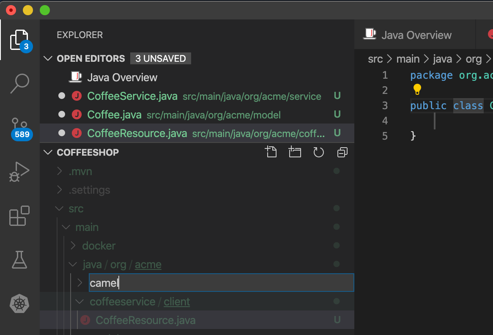

In this new folder, create a new file called `CoffeeRouteBuilder.java`.

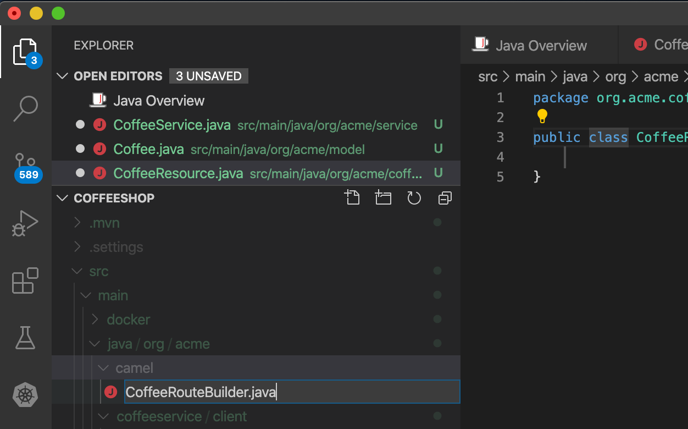

Replace the content of our new `CoffeeRouteBuilder.java` file with the following code snippet:

```java
package org.acme.camel;

import javax.enterprise.context.ApplicationScoped;
import javax.ws.rs.core.MediaType;

import org.acme.model.Coffee;

import org.apache.camel.builder.RouteBuilder;
import org.apache.camel.component.jackson.JacksonDataFormat;
import org.apache.camel.component.jackson.ListJacksonDataFormat;

@ApplicationScoped
public class CoffeeRouteBuilder extends RouteBuilder {

    @ConfigProperty(name = "coffeeresource.camel.url", defaultValue = "netty-http:http://localhost:8090/coffee") 
    String url;

    @Override
    public void configure() throws Exception {

        JacksonDataFormat format = new ListJacksonDataFormat(Coffee.class);

        from("direct://getCoffees").log("Get Coffee Route Triggered: ${body}")
        .setHeader("Accept").constant(MediaType.APPLICATION_JSON)
        .setHeader("CamelHttpMethod").constant("GET")
        .to(url)
        .unmarshal(format);

    }

}
```

The route is pretty simple. It accepts an exchange (message) from a "direct" endpoint (which allows us to call this endpoint from our CDI bean),
it sets the required HTTP headers (`Accept`), it sets the HTTP method that we want to use, and uses the `netty-http` component to do a call to our CoffeeService.
Finally, the response is unmarshalled into a `Collection` of `Coffee` instances using the `JacksonDataFormat` instance.

With our route implemented, we can change our `CoffeeService` implementation to use our Camel route.
Open our `CoffeeService.java` file, and replace its content with the following code:

```java
package org.acme.service;

import java.util.Collection;

import javax.annotation.PostConstruct;
import javax.annotation.PreDestroy;
import javax.enterprise.context.ApplicationScoped;
import javax.inject.Inject;

import org.acme.coffeeservice.client.CoffeeResource;
import org.acme.model.Coffee;

import org.apache.camel.CamelContext;
import org.apache.camel.FluentProducerTemplate;

import org.slf4j.Logger;
import org.slf4j.LoggerFactory;

@ApplicationScoped
public class CoffeeService {

    private static final Logger LOGGER = LoggerFactory.getLogger(CoffeeService.class);

//Add CamelContext

//Add FluentProducerTemplate

//Add PostConstruct

//Add PreDestroy

    public Collection<Coffee> getCoffees() {
        LOGGER.debug("Retrieving coffees");
//Add Method Implementation
    }

}
```

Next, we need to inject the `CamelContext` into our class.
Add the following code snippet to the `CoffeeService.java` class, at the place of the `//Add CamelContext` comment:

```java
    @Inject
    CamelContext camelContext;
```

Next, we need to define a variable for our Camel `FluentProducerTemplate`.
Add the following code snippet to the `CoffeeService.java` class, at the place of the `//Add FluentProducerTemplate` comment:

```java
    private FluentProducerTemplate producer;
```

We will initialize this producer when our bean starts using an `@PostConstruct` annotation.
Add the following code snippet to the `CoffeeService.java` class, at the place of the `//Add PostConstruct` comment:

```java
    @PostConstruct
    void init() {
       producer = camelContext.createFluentProducerTemplate();
       producer.setDefaultEndpointUri("direct://getCoffees");
    }
```


We also want stop this producer when our bean stops using an `@PreDestroy` annotation.
Add the following code snippet to the `CoffeeService.java` class, at the place of the `//Add PreDestroy` comment:

```java
    @PreDestroy
    void destroy() {
      producer.stop();
    }
```

With all the plumbing in place, we can implement the method which calls the Camel route, which in its turn calls the microservice via REST.
Add the following code snippet to the `CoffeeService.java` class, at the place of the `//Add Method Implementation` comment:

```java
    return producer.request(Collection.class);
```

== Starting the Application

Start the application by executing the following command in a terminal:

`$ mvn clean compile quarkus:dev`

This downloads the new dependencies and starts our application in Quarkus development mode.

== Testing the Application

Execute the following cURL command in a terminal to sens a request to our Kogito CoffeeShop service.

`$ curl -X POST "http://localhost:8080/coffeeshop" -H "accept: application/json" -H "Content-Type: application/json" -d "{}"`

We should see the following output in the console:

```console
[{"id":1,"name":"espresso-arabica","description":"arabica beans","price":2.0},{"id":2,"name":"espresso-robusta","description":"robusta beans","price":2.0},{"id":3,"name":"latte-arabica","description":"arabica beans, full fat bio milk","price":3.0}]
```

= Deploy to OpenShift (optional)

Kogito has been designed for cloud-native deployments and container-based architectures. Kogito provides an _Operator_ for OpenShift which allows us to quickly and easily deploy Kogito services to OpenShift Container Platform.

We will be using the `kogito` CLI (Command Line Interface) and the `oc` (OpenShift Client) CLI to create a new project on OpenShift, provision the Kogito Operator, and deploy our first Kogito service.

To be able to continue with this part of the lab, you will need to have access to an OpenShift instance and have your `oc` client connected to your OpenShift instance. More information on OpenShift and how to setup a local OpenShift development environment based on the Red Hat Container Ready Containers can be found https://developers.redhat.com/products/codeready-containers/overview[here].

Execute the following command to verify that your `oc` client is connected to a running OpenShift instance:

```
$ oc status

In project default on server https://api.crc.testing:6443

svc/openshift - kubernetes.default.svc.cluster.local
svc/kubernetes - 172.30.0.1:443 -> 6443

View details with 'oc describe <resource>/<name>' or list everything with 'oc get all'.
```

== Create the Kogito OpenShift project

With our `oc` client connected, we can now create a new OpenShift project using the `kogito` CLI. When creating a new project using the `kogito` CLI, the tool not only creates a new project, but also installs the Kogito Operator. This operator is responsible for managing your Kogito services, support services and required infrastructure.

```
$ kogito new-project coffeeshop
```

When you now navigate to your OpenShift Console, you will see that a new project has been created. Also, when you navigate to the `Installed Operators` view of your project, you can see that the Kogito Operator, and the Operator it depends on have been installed in your new project: 

image:images/openshift-installed-operators.png[OpenShift Installed Operators]


== Deploy CoffeeService

Our Kogito service uses the `coffeeservice` which provides the list of coffees. We therefore need to deploy this `coffeeservice` to OpenShift first. Since our `coffeeservice` is a Quarkus application, we can package it as a runnable JAR file with the following command:

```
$ mvn clean package -DskipTests
```

This will produce a `coffeeservice-quarkus-1.0-SNAPSHOT-runner.jar` runnable JAR in the project's `target` directory.

Since this is a Quarkus application, just like our Kogito applications, we can simply use the Kogito Operator to deploy our `coffeeservice-quarkus`:

```
$ kogito deploy-service coffeeservice-quarkus -e QUARKUS_HTTP_PORT=8080
```

NOTE: Because the application has been configured, in its `application.properties` file to run on port 8090 (to prevent port conflicts when running multiple applications on the same machine), we now use an environment variable to configure the application to run on port 8080.

In the OpenShift Console, navigate to your project. Via the menu on the left-hand side of the screen navigate to _Operators -> Installed Operators_. Click on the `Kogito` Operator. In the Kogito Operator screen, click on the `Kogito Service` tab. Observe that an `coffeeservice-quarkus` Service has been created.

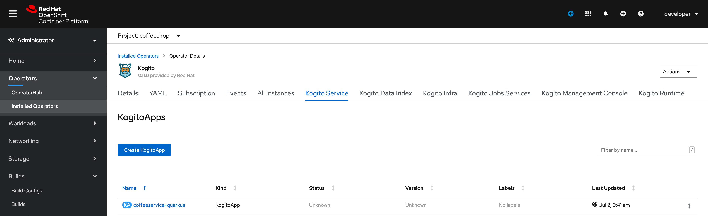

With our service definition ready, we can pass our runnable JAR to the binary build of our service:

```
$ oc start-build coffeeservice-quarkus-binary --from-dir=target/
```

Once the build has finished, a new deployment configuration, service and route will be created for our service.

We can retrieve the route to our service with the following command:

```
$ oc get route

NAME                    HOST/PORT                                           PATH   SERVICES                PORT   TERMINATION   WILDCARD
coffeeservice-quarkus   coffeeservice-quarkus-coffeeshop.apps-crc.testing          coffeeservice-quarkus   http                 None
```

And we can retrieve the list of coffees by sending a GET request to this route (note: make sure to use the route you retrieved in the previous command when sending this request):

```
$ curl -X GET "http://coffeeservice-quarkus-coffeeshop.apps-crc.testing/coffee" -H "accept: application/json" -d "{}"

[{"id":1,"name":"espresso-arabica","description":"arabica beans","price":2.0},{"id":2,"name":"espresso-robusta","description":"robusta beans","price":2.0},{"id":3,"name":"latte-arabica","description":"arabica beans, full fat bio milk","price":3.0}]
```

With our Quarkus REST service deployed on OpenShift, we can now deploy our Kogito service.

== Deploy CoffeeShop Service

Go back to your terminal and execute the following command to create a new Kogito service definition for our `coffeeshop-service`:

```
$ kogito deploy-service coffeeshop-service -e COFFEERESOURCE_CAMEL_URL="netty-http:http://coffeeservice-quarkus:8080/coffee" 
```

NOTE: The `deploy-service` operation can be executed with different arguments. When no argument is passed, the operator will create an OpenShift Build Confguration for _binary builds_. This allows you to build your Kogito service locally and pass the built JAR or native executable to the build configuration to be packaged in a container. You can also specify the location of a Git repository which contains your Kogito project. When you do this, the Kogito Operator will create an S2I (Source-to-Image) Build Configuration which will checkout your source code from the repository and compile and build your project on the OpenShift cluster.

NOTE: In this lab we will be using the _binary build_ approach, as an S2I build without a Maven proxy/repository installed on the cluster tends to be slow (especially the first time you build a new project). Using the _binary build_ approach, we can build our project locally and push the binary to OpenShift to be packaged in a container.

NOTE: We're setting the environment variable to set the `coffeeresource.camel.url` property to the `coffeeservice-quarkus` service in our OpenShift project (instead of pointing to `localhost`).

In the OpenShift Console, navigate to your project. Via the menu on the left-hand side of the screen navigate to _Operators -> Installed Operators_. Click on the `Kogito` Operator. In the Kogito Operator screen, click on the `Kogito Service` tab. Observe that an `coffeeshop-service` Kogito Service has been created.

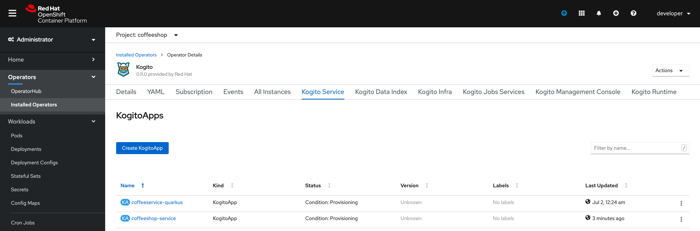

We can check that the Operator has created the required _Build Configuration_ of our project using our `oc` client:

```
$ oc get bc

NAME                            TYPE     FROM     LATEST
coffeeservice-quarkus           Source            0
coffeeservice-quarkus-binary    Source   Binary   1
coffeeservice-quarkus-builder   Source   Binary   0
coffeeshop-service              Source            0
coffeeshop-service-binary       Source   Binary   0
coffeeshop-service-builder      Source   Binary   0
```

... and as we can see, a `coffeeshop-service-binary` build configuration has been created.

NOTE: The Operator has only created the build configuraion and image streams. No _Deployment Config_, _Service_ or _Route_ has been created yet. These resources will be created once our first build has completed and a container image of our application is available.

== Kogito OpenShift Binary Build

To start a binary build, we first need to build our runnable JAR locally first. In the root directory of the `coffeeshop-service` (the directory that contains the project's `pom.xml` file), execute the following commmand:

```
$ mvn clean package -DskipTests
```

This will produce a `coffeeshop-1.0-SNAPSHOT-runner.jar` runnable JAR in the project's `target` directory.

We can now send this JAR file to the binary build using the following command:

```
$ oc start-build coffeeshop-service-binary --from-dir=target/
```

This will upload the `target` directory to OpenShift. The build will filter out the assets it requires (runnable JAR, library directory) and package the binary in a container image that can be deployed on OpenShift.

You can follow the progress of the build using the following command (given that `coffeeshop-service-binary-1` is the name of your first build instance. You can get a list with the names of the builds with `oc get build`):

```
$ oc logs -f build/coffeeshop-service-binary-1
```

Once the build is finished, and the created container image is pushed to the image stream, the Kogito Operator will create the other resources of our application. Execute the following command to retrieve information about the _Deployment Config_:

```
$ oc get dc

NAME                    REVISION   DESIRED   CURRENT   TRIGGERED BY
coffeeservice-quarkus   2          1         1         config,image(coffeeservice-quarkus:latest)
coffeeshop-service      1          1         1         config,image(coffeeshop-service:latest)
```

And the following command to retrieve the serviced:

```
$ oc get svc

NAME                        TYPE        CLUSTER-IP       EXTERNAL-IP   PORT(S)             AGE
coffeeservice-quarkus       ClusterIP   172.30.132.44    <none>        8080/TCP            171m
coffeeshop-service          ClusterIP   172.30.51.24     <none>        8080/TCP            6m54s
keycloak-operator-metrics   ClusterIP   172.30.119.218   <none>        8383/TCP,8686/TCP   5h34m
kogito-operator-metrics     ClusterIP   172.30.20.10     <none>        8383/TCP,8686/TCP   5h33m
```

And this command to retriev the route:

```
$ oc get route

NAME                    HOST/PORT                                           PATH   SERVICES                PORT   TERMINATION   WILDCARD
coffeeservice-quarkus   coffeeservice-quarkus-coffeeshop.apps-crc.testing          coffeeservice-quarkus   http                 None
coffeeshop-service      coffeeshop-service-coffeeshop.apps-crc.testing             coffeeshop-service      http                 None
```

== Test the Kogito Service

We can use the route that we retrieved with our last command to evaluate our data against the rules of our `airmiles-service`. Execute the following commmand using cURL (replace the host and port with the information retrieved from your route):

```
$ curl -X POST "http://coffeeshop-service-coffeeshop.apps-crc.testing/coffeeshop" -H "accept: application/json" -H "Content-Type: application/json" -d "{}"

{"id":"fb649361-74e5-4b78-a084-29ec53181f9e","coffees":[{"id":1,"name":"espresso-arabica","description":"arabica beans","price":2.0},{"id":2,"name":"espresso-robusta","description":"robusta beans","price":2.0},{"id":3,"name":"latte-arabica","description":"arabica beans, full fat bio milk","price":3.0}]}
```

We can also access the Swagger-UI at http://coffeeshop-service-coffeeshop.apps-crc.testing/swagger-ui/ (again, replace the host and port with the values for your environment).

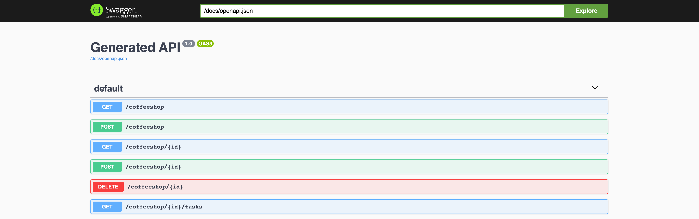


== Congratulations!

We've implemented the integration with our CoffeeService using Apache Camel's `netty-http` component. Well done!

In this lab, we've learned how we can use both a Quarkus JAX-RS client, as well as a Camel Route to integrate a Kogito with RESTful microservices.
We've seen how we can utilize the Kogito CDI support to implement the bridge between our process definition's BPMN2 Service Task and our integration logic.

Kogito gives cloud-native developers the ability to use their skillset and combine it with the power of process, workflow, rules and decision automation capabilities, providing a complete toolkit to build cloud-native business applications and systems.
